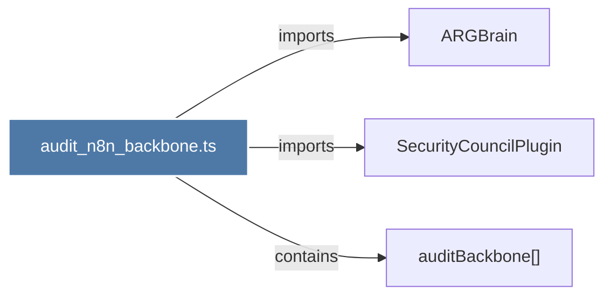

# audit_n8n_backbone.ts

> [!info] Properties
> **File Type**: code
> **Community**: [[_COMMUNITY_Community None|Community None]]
> **Degree**: 3

## Architecture Graph


## Outbound Connections
- [[ARGBrain]] - `imports` [EXTRACTED]
- [[SecurityCouncilPlugin]] - `imports` [EXTRACTED]
- [[auditBackbone()]] - `contains` [EXTRACTED]

## Inbound Dependencies
> [!abstract]- Files that link here
```dataview
LIST
FROM [[audit_n8n_backbone.ts]]
```

#graphify/code #graphify/EXTRACTED #community/Community_None