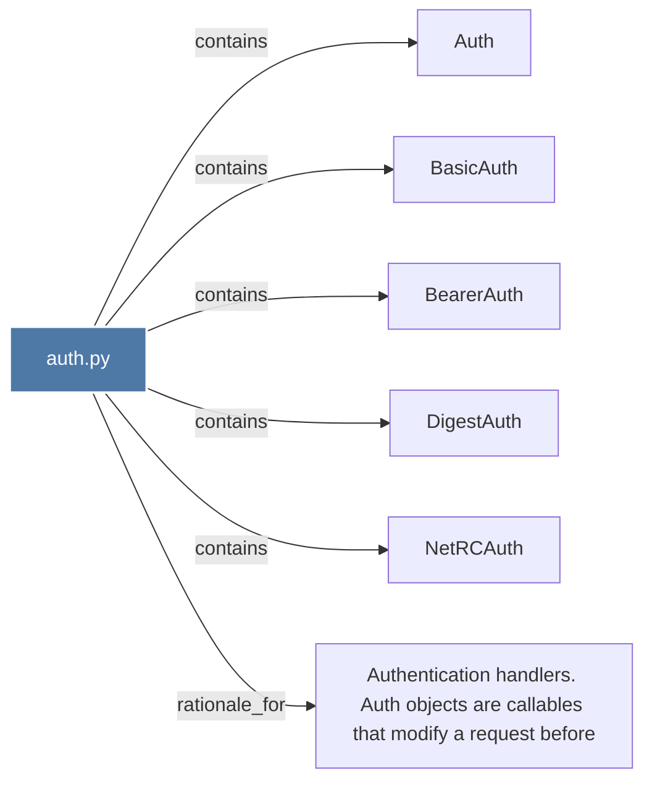

# auth.py

> [!info] Properties
> **File Type**: code
> **Community**: [[_COMMUNITY_Community None|Community None]]
> **Degree**: 6

## Architecture Graph


## Outbound Connections
- [[Auth]] - `contains` [EXTRACTED]
- [[Authentication handlers. Auth objects are callables that modify a request before]] - `rationale_for` [EXTRACTED]
- [[BasicAuth]] - `contains` [EXTRACTED]
- [[BearerAuth]] - `contains` [EXTRACTED]
- [[DigestAuth]] - `contains` [EXTRACTED]
- [[NetRCAuth]] - `contains` [EXTRACTED]

## Inbound Dependencies
> [!abstract]- Files that link here
```dataview
LIST
FROM [[auth.py]]
```

#graphify/code #graphify/EXTRACTED #community/Community_None