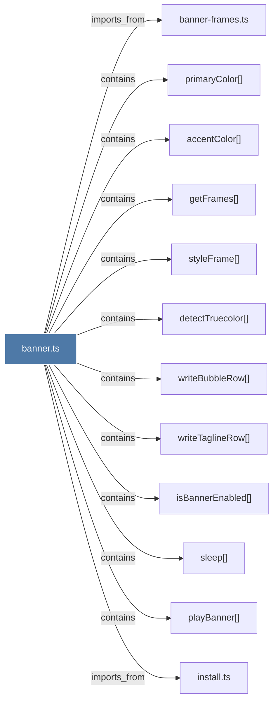

# banner.ts

> [!info] Properties
> **File Type**: code
> **Community**: [[_COMMUNITY_Community None|Community None]]
> **Degree**: 12

## Architecture Graph


## Outbound Connections
- [[accentColor()]] - `contains` [EXTRACTED]
- [[banner-frames.ts]] - `imports_from` [EXTRACTED]
- [[detectTruecolor()]] - `contains` [EXTRACTED]
- [[getFrames()]] - `contains` [EXTRACTED]
- [[install.ts]] - `imports_from` [EXTRACTED]
- [[isBannerEnabled()]] - `contains` [EXTRACTED]
- [[playBanner()]] - `contains` [EXTRACTED]
- [[primaryColor()]] - `contains` [EXTRACTED]
- [[sleep()_1]] - `contains` [EXTRACTED]
- [[styleFrame()]] - `contains` [EXTRACTED]
- [[writeBubbleRow()]] - `contains` [EXTRACTED]
- [[writeTaglineRow()]] - `contains` [EXTRACTED]

## Inbound Dependencies
> [!abstract]- Files that link here
```dataview
LIST
FROM [[banner.ts]]
```

#graphify/code #graphify/EXTRACTED #community/Community_None