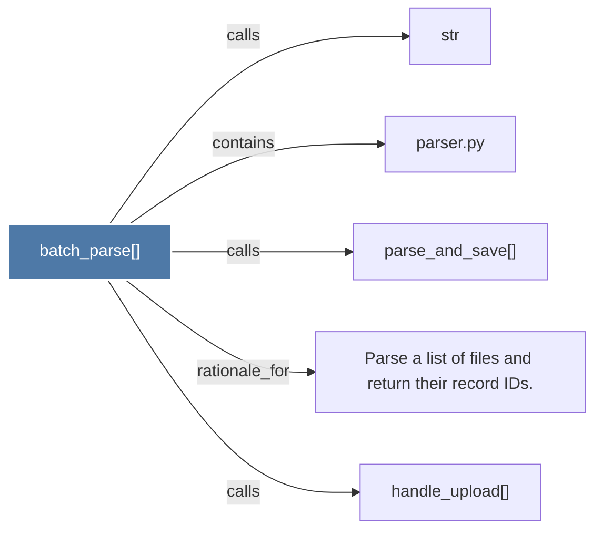

# batch_parse()

> [!info] Properties
> **File Type**: code
> **Community**: [[_COMMUNITY_Community None|Community None]]
> **Degree**: 5

## Architecture Graph


## Outbound Connections
- [[Parse a list of files and return their record IDs.]] - `rationale_for` [EXTRACTED]
- [[handle_upload()]] - `calls` [INFERRED]
- [[parse_and_save()]] - `calls` [EXTRACTED]
- [[parser.py]] - `contains` [EXTRACTED]
- [[str]] - `calls` [INFERRED]

## Inbound Dependencies
> [!abstract]- Files that link here
```dataview
LIST
FROM [[batch_parse()]]
```

#graphify/code #graphify/EXTRACTED #community/Community_None