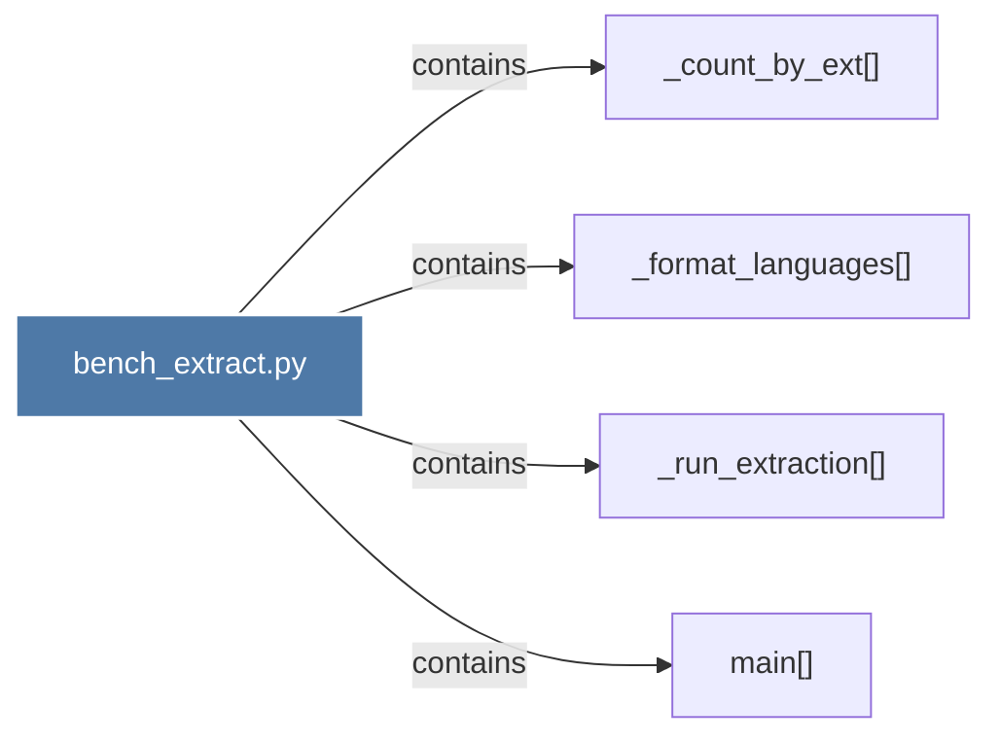

# bench_extract.py

> [!info] Properties
> **File Type**: code
> **Community**: [[_COMMUNITY_Community None|Community None]]
> **Degree**: 4

## Architecture Graph


## Outbound Connections
- [[_count_by_ext()]] - `contains` [EXTRACTED]
- [[_format_languages()]] - `contains` [EXTRACTED]
- [[_run_extraction()]] - `contains` [EXTRACTED]
- [[main()]] - `contains` [EXTRACTED]

## Inbound Dependencies
> [!abstract]- Files that link here
```dataview
LIST
FROM [[bench_extract.py]]
```

#graphify/code #graphify/EXTRACTED #community/Community_None