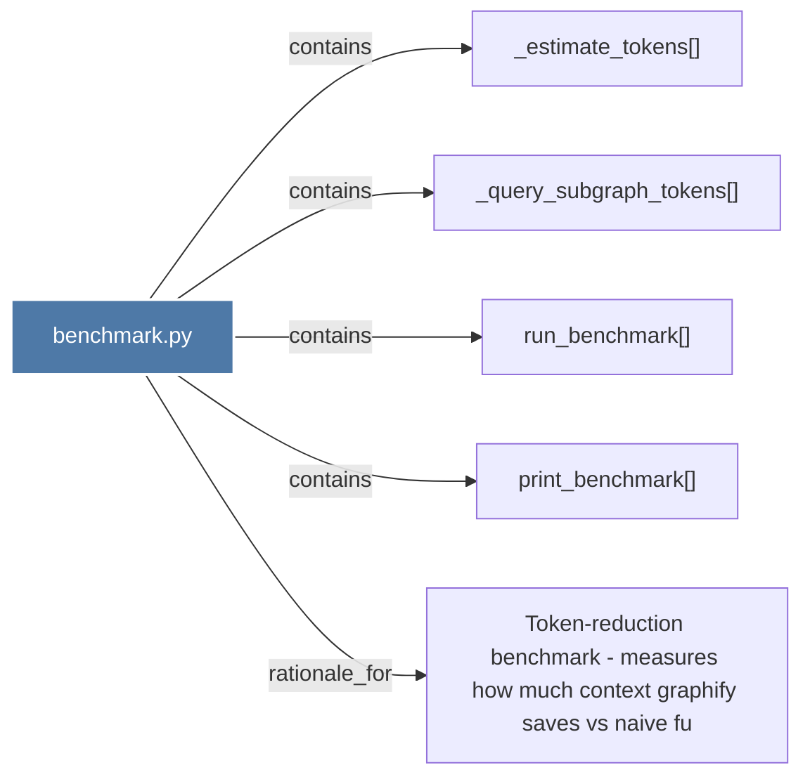

# benchmark.py

> [!info] Properties
> **File Type**: code
> **Community**: [[_COMMUNITY_Community None|Community None]]
> **Degree**: 5

## Architecture Graph


## Outbound Connections
- [[Token-reduction benchmark - measures how much context graphify saves vs naive fu]] - `rationale_for` [EXTRACTED]
- [[_estimate_tokens()]] - `contains` [EXTRACTED]
- [[_query_subgraph_tokens()]] - `contains` [EXTRACTED]
- [[print_benchmark()]] - `contains` [EXTRACTED]
- [[run_benchmark()]] - `contains` [EXTRACTED]

## Inbound Dependencies
> [!abstract]- Files that link here
```dataview
LIST
FROM [[benchmark.py]]
```

#graphify/code #graphify/EXTRACTED #community/Community_None