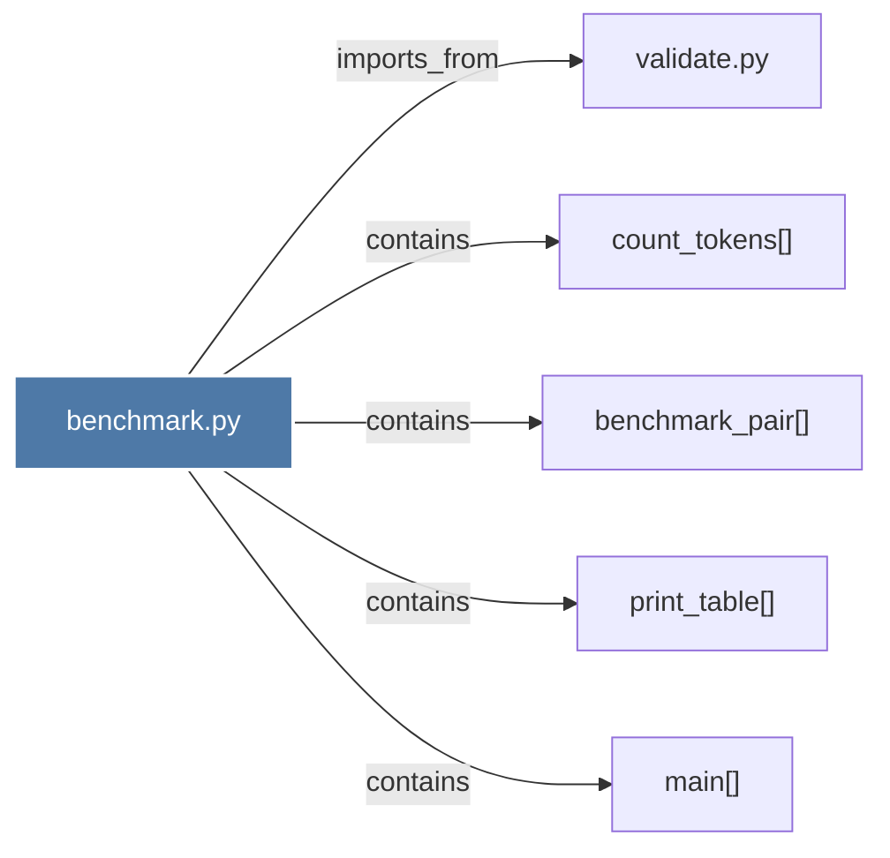

# benchmark.py

> [!info] Properties
> **File Type**: code
> **Community**: [[_COMMUNITY_Community None|Community None]]
> **Degree**: 5

## Architecture Graph


## Outbound Connections
- [[benchmark_pair()]] - `contains` [EXTRACTED]
- [[count_tokens()]] - `contains` [EXTRACTED]
- [[main()_11]] - `contains` [EXTRACTED]
- [[print_table()]] - `contains` [EXTRACTED]
- [[validate.py_1]] - `imports_from` [EXTRACTED]

## Inbound Dependencies
> [!abstract]- Files that link here
```dataview
LIST
FROM [[benchmark.py_1]]
```

#graphify/code #graphify/EXTRACTED #community/Community_None