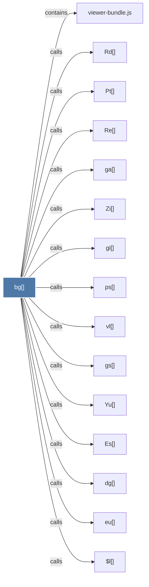

# bg()

> [!info] Properties
> **File Type**: code
> **Community**: [[_COMMUNITY_Community None|Community None]]
> **Degree**: 15

## Architecture Graph


## Outbound Connections
- [[$l()]] - `calls` [EXTRACTED]
- [[Es()]] - `calls` [EXTRACTED]
- [[Pt()]] - `calls` [EXTRACTED]
- [[Rd()]] - `calls` [EXTRACTED]
- [[Re()]] - `calls` [EXTRACTED]
- [[Yu()]] - `calls` [EXTRACTED]
- [[Zi()]] - `calls` [EXTRACTED]
- [[dg()]] - `calls` [EXTRACTED]
- [[eu()]] - `calls` [EXTRACTED]
- [[ga()]] - `calls` [EXTRACTED]
- [[gi()]] - `calls` [EXTRACTED]
- [[gs()]] - `calls` [EXTRACTED]
- [[ps()]] - `calls` [EXTRACTED]
- [[viewer-bundle.js]] - `contains` [EXTRACTED]
- [[vl()]] - `calls` [EXTRACTED]

## Inbound Dependencies
> [!abstract]- Files that link here
```dataview
LIST
FROM [[bg()]]
```

#graphify/code #graphify/EXTRACTED #community/Community_None