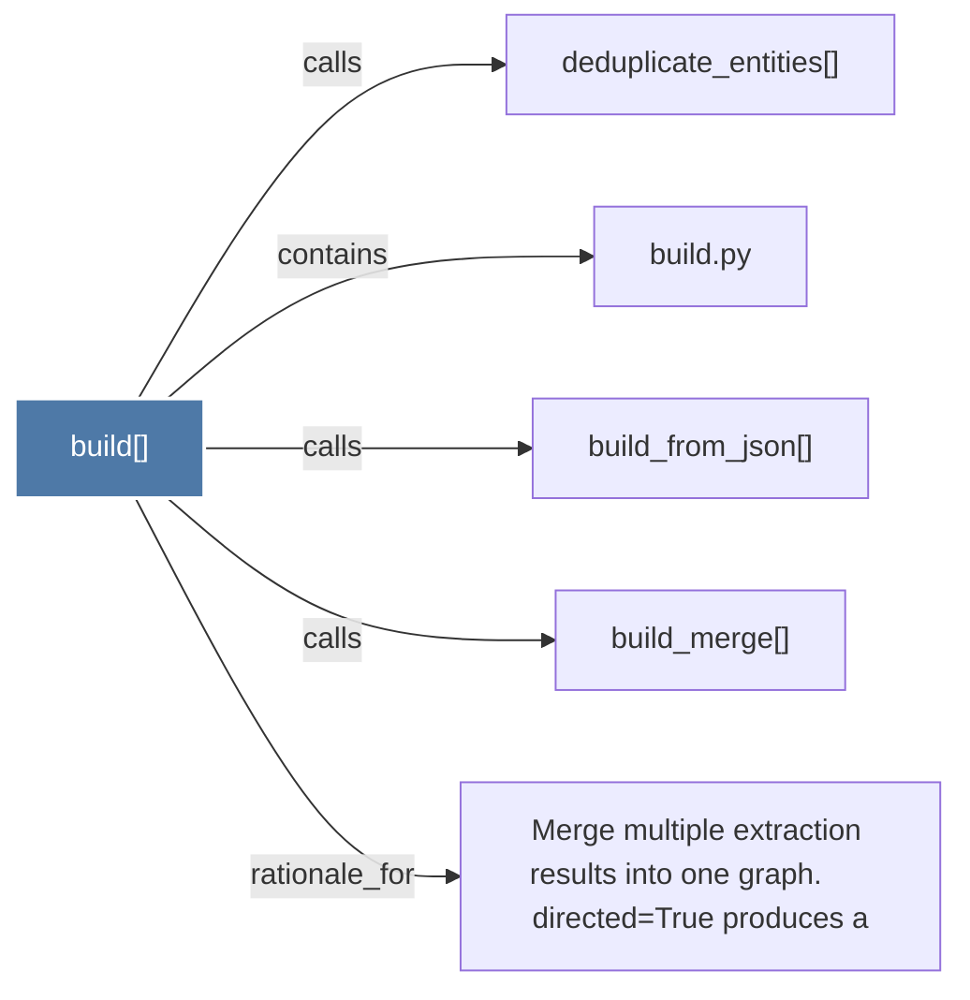

# build()

> [!info] Properties
> **File Type**: code
> **Community**: [[_COMMUNITY_Community None|Community None]]
> **Degree**: 5

## Architecture Graph


## Outbound Connections
- [[Merge multiple extraction results into one graph.      directed=True produces a]] - `rationale_for` [EXTRACTED]
- [[build.py]] - `contains` [EXTRACTED]
- [[build_from_json()]] - `calls` [EXTRACTED]
- [[build_merge()]] - `calls` [EXTRACTED]
- [[deduplicate_entities()]] - `calls` [INFERRED]

## Inbound Dependencies
> [!abstract]- Files that link here
```dataview
LIST
FROM [[build()]]
```

#graphify/code #graphify/EXTRACTED #community/Community_None