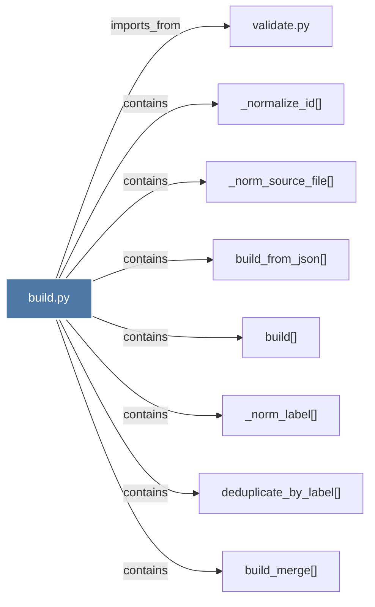

# build.py

> [!info] Properties
> **File Type**: code
> **Community**: [[_COMMUNITY_Community None|Community None]]
> **Degree**: 8

## Architecture Graph


## Outbound Connections
- [[_norm_label()]] - `contains` [EXTRACTED]
- [[_norm_source_file()]] - `contains` [EXTRACTED]
- [[_normalize_id()]] - `contains` [EXTRACTED]
- [[build()]] - `contains` [EXTRACTED]
- [[build_from_json()]] - `contains` [EXTRACTED]
- [[build_merge()]] - `contains` [EXTRACTED]
- [[deduplicate_by_label()]] - `contains` [EXTRACTED]
- [[validate.py]] - `imports_from` [EXTRACTED]

## Inbound Dependencies
> [!abstract]- Files that link here
```dataview
LIST
FROM [[build.py]]
```

#graphify/code #graphify/EXTRACTED #community/Community_None