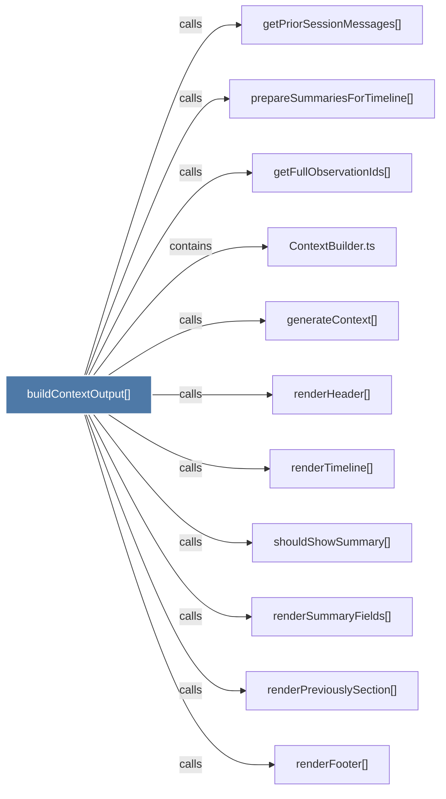

# buildContextOutput()

> [!info] Properties
> **File Type**: code
> **Community**: [[_COMMUNITY_Community None|Community None]]
> **Degree**: 11

## Architecture Graph


## Outbound Connections
- [[ContextBuilder.ts]] - `contains` [EXTRACTED]
- [[generateContext()]] - `calls` [EXTRACTED]
- [[getFullObservationIds()]] - `calls` [INFERRED]
- [[getPriorSessionMessages()]] - `calls` [INFERRED]
- [[prepareSummariesForTimeline()]] - `calls` [INFERRED]
- [[renderFooter()]] - `calls` [INFERRED]
- [[renderHeader()]] - `calls` [INFERRED]
- [[renderPreviouslySection()]] - `calls` [INFERRED]
- [[renderSummaryFields()]] - `calls` [INFERRED]
- [[renderTimeline()]] - `calls` [INFERRED]
- [[shouldShowSummary()]] - `calls` [INFERRED]

## Inbound Dependencies
> [!abstract]- Files that link here
```dataview
LIST
FROM [[buildContextOutput()]]
```

#graphify/code #graphify/INFERRED #community/Community_None