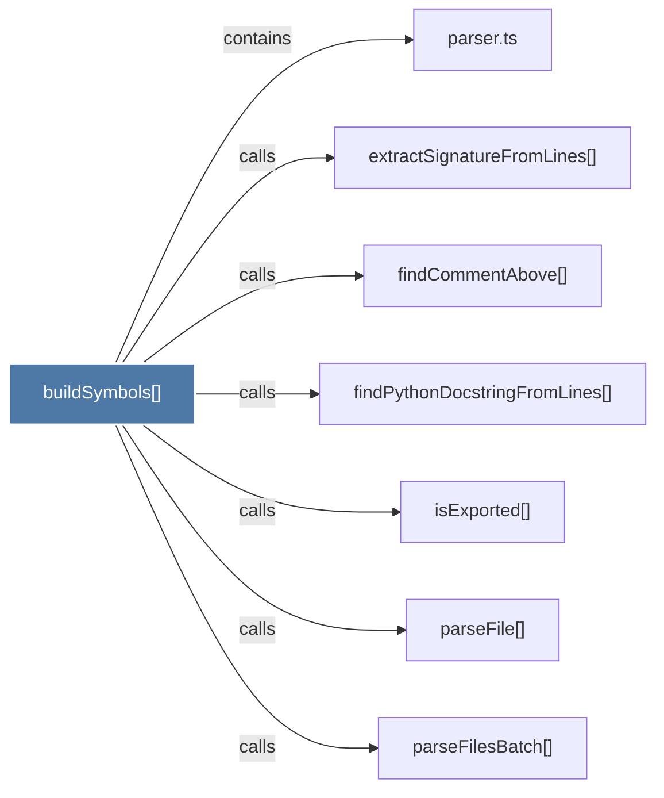

# buildSymbols()

> [!info] Properties
> **File Type**: code
> **Community**: [[_COMMUNITY_Community None|Community None]]
> **Degree**: 7

## Architecture Graph


## Outbound Connections
- [[extractSignatureFromLines()]] - `calls` [EXTRACTED]
- [[findCommentAbove()]] - `calls` [EXTRACTED]
- [[findPythonDocstringFromLines()]] - `calls` [EXTRACTED]
- [[isExported()]] - `calls` [EXTRACTED]
- [[parseFile()]] - `calls` [EXTRACTED]
- [[parseFilesBatch()]] - `calls` [EXTRACTED]
- [[parser.ts_1]] - `contains` [EXTRACTED]

## Inbound Dependencies
> [!abstract]- Files that link here
```dataview
LIST
FROM [[buildSymbols()]]
```

#graphify/code #graphify/EXTRACTED #community/Community_None