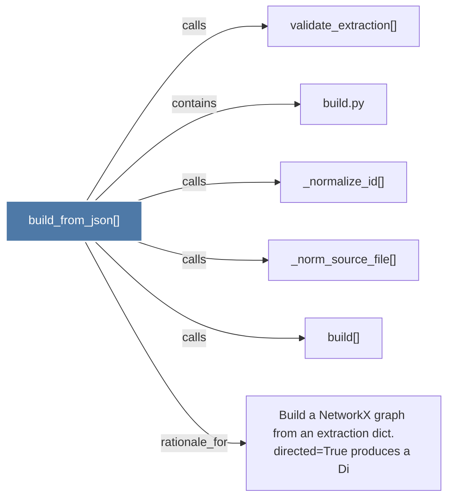

# build_from_json()

> [!info] Properties
> **File Type**: code
> **Community**: [[_COMMUNITY_Community None|Community None]]
> **Degree**: 6

## Architecture Graph


## Outbound Connections
- [[Build a NetworkX graph from an extraction dict.      directed=True produces a Di]] - `rationale_for` [EXTRACTED]
- [[_norm_source_file()]] - `calls` [EXTRACTED]
- [[_normalize_id()]] - `calls` [EXTRACTED]
- [[build()]] - `calls` [EXTRACTED]
- [[build.py]] - `contains` [EXTRACTED]
- [[validate_extraction()]] - `calls` [INFERRED]

## Inbound Dependencies
> [!abstract]- Files that link here
```dataview
LIST
FROM [[build_from_json()]]
```

#graphify/code #graphify/EXTRACTED #community/Community_None