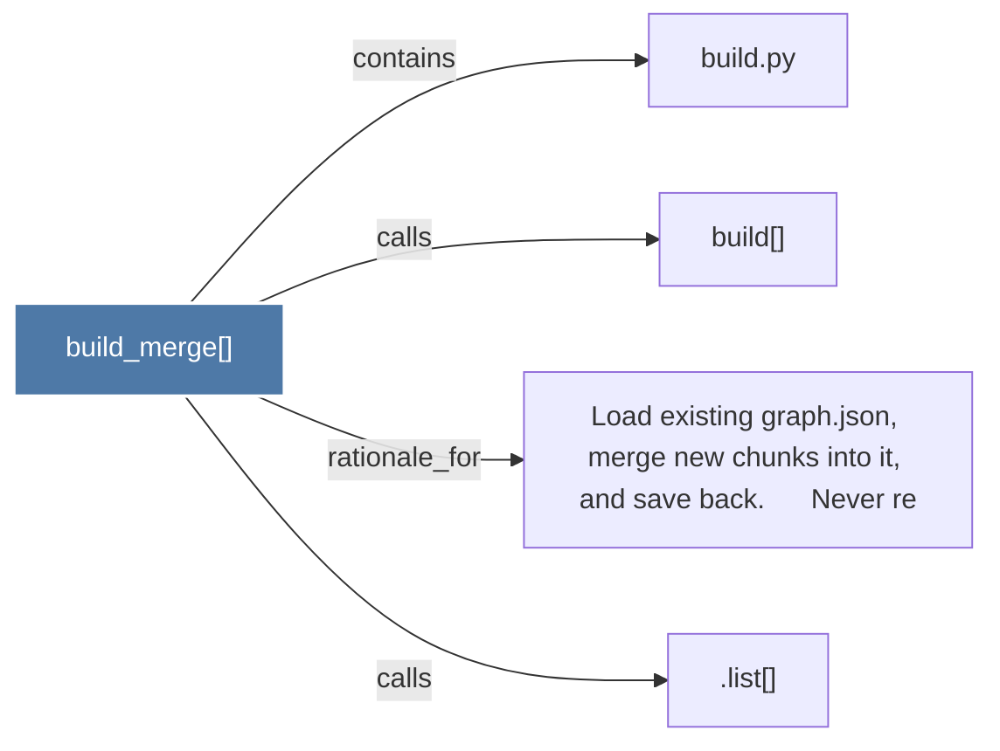

# build_merge()

> [!info] Properties
> **File Type**: code
> **Community**: [[_COMMUNITY_Community None|Community None]]
> **Degree**: 4

## Architecture Graph


## Outbound Connections
- [[.list()]] - `calls` [INFERRED]
- [[Load existing graph.json, merge new chunks into it, and save back.      Never re]] - `rationale_for` [EXTRACTED]
- [[build()]] - `calls` [EXTRACTED]
- [[build.py]] - `contains` [EXTRACTED]

## Inbound Dependencies
> [!abstract]- Files that link here
```dataview
LIST
FROM [[build_merge()]]
```

#graphify/code #graphify/EXTRACTED #community/Community_None