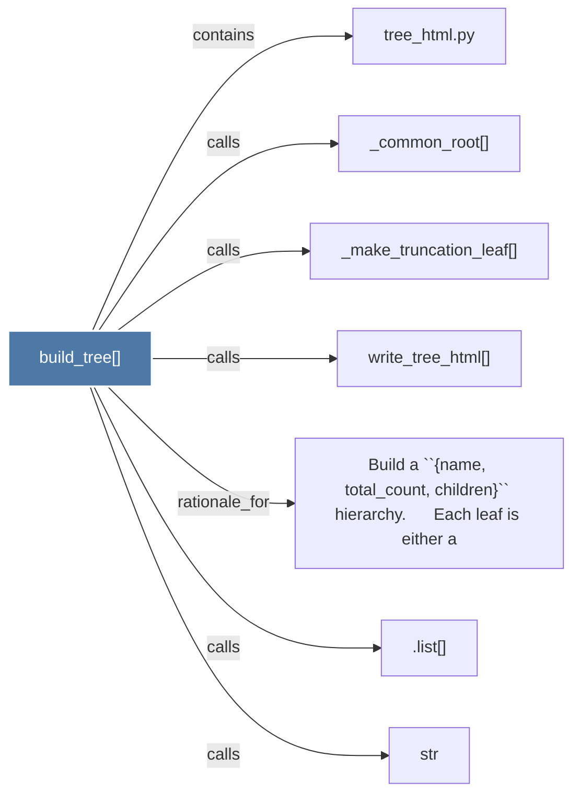

# build_tree()

> [!info] Properties
> **File Type**: code
> **Community**: [[_COMMUNITY_Community None|Community None]]
> **Degree**: 7

## Architecture Graph


## Outbound Connections
- [[.list()]] - `calls` [INFERRED]
- [[Build a ``{name, total_count, children}`` hierarchy.      Each leaf is either a]] - `rationale_for` [EXTRACTED]
- [[_common_root()]] - `calls` [EXTRACTED]
- [[_make_truncation_leaf()]] - `calls` [EXTRACTED]
- [[str]] - `calls` [INFERRED]
- [[tree_html.py]] - `contains` [EXTRACTED]
- [[write_tree_html()]] - `calls` [EXTRACTED]

## Inbound Dependencies
> [!abstract]- Files that link here
```dataview
LIST
FROM [[build_tree()]]
```

#graphify/code #graphify/EXTRACTED #community/Community_None