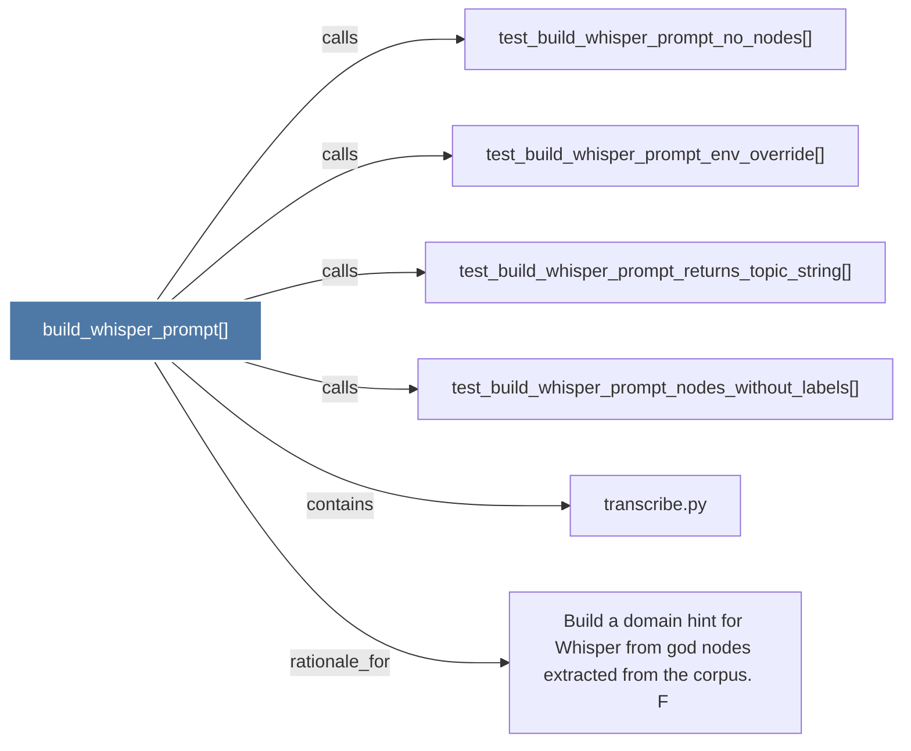

# build_whisper_prompt()

> [!info] Properties
> **File Type**: code
> **Community**: [[_COMMUNITY_Community None|Community None]]
> **Degree**: 6

## Architecture Graph


## Outbound Connections
- [[Build a domain hint for Whisper from god nodes extracted from the corpus.      F]] - `rationale_for` [EXTRACTED]
- [[test_build_whisper_prompt_env_override()]] - `calls` [INFERRED]
- [[test_build_whisper_prompt_no_nodes()]] - `calls` [INFERRED]
- [[test_build_whisper_prompt_nodes_without_labels()]] - `calls` [INFERRED]
- [[test_build_whisper_prompt_returns_topic_string()]] - `calls` [INFERRED]
- [[transcribe.py]] - `contains` [EXTRACTED]

## Inbound Dependencies
> [!abstract]- Files that link here
```dataview
LIST
FROM [[build_whisper_prompt()]]
```

#graphify/code #graphify/INFERRED #community/Community_None