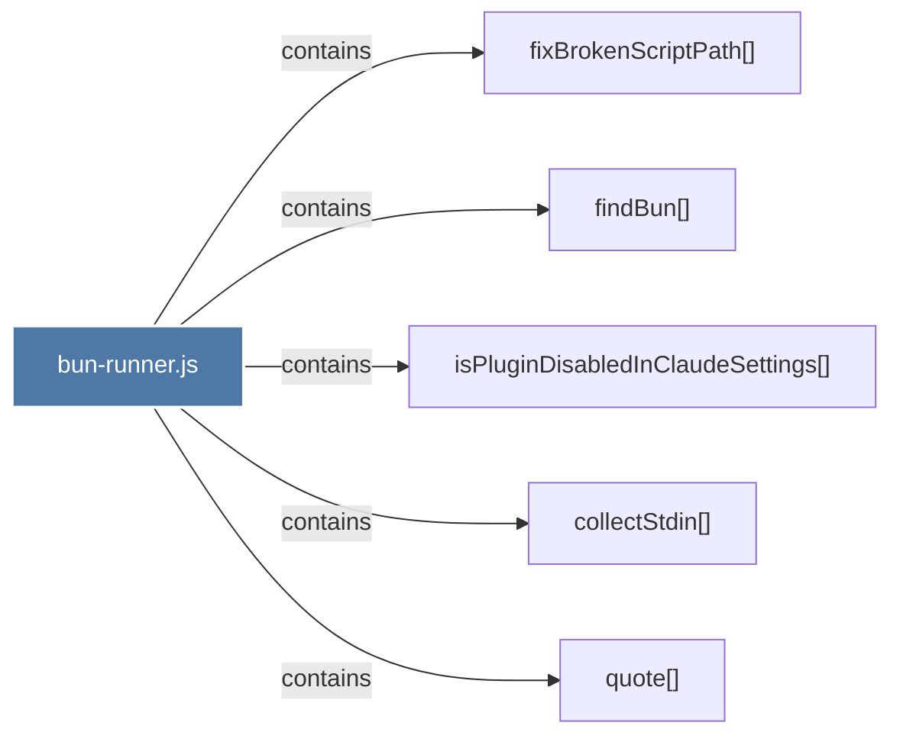

# bun-runner.js

> [!info] Properties
> **File Type**: code
> **Community**: [[_COMMUNITY_Community None|Community None]]
> **Degree**: 5

## Architecture Graph


## Outbound Connections
- [[collectStdin()]] - `contains` [EXTRACTED]
- [[findBun()]] - `contains` [EXTRACTED]
- [[fixBrokenScriptPath()]] - `contains` [EXTRACTED]
- [[isPluginDisabledInClaudeSettings()_1]] - `contains` [EXTRACTED]
- [[quote()]] - `contains` [EXTRACTED]

## Inbound Dependencies
> [!abstract]- Files that link here
```dataview
LIST
FROM [[bun-runner.js]]
```

#graphify/code #graphify/EXTRACTED #community/Community_None