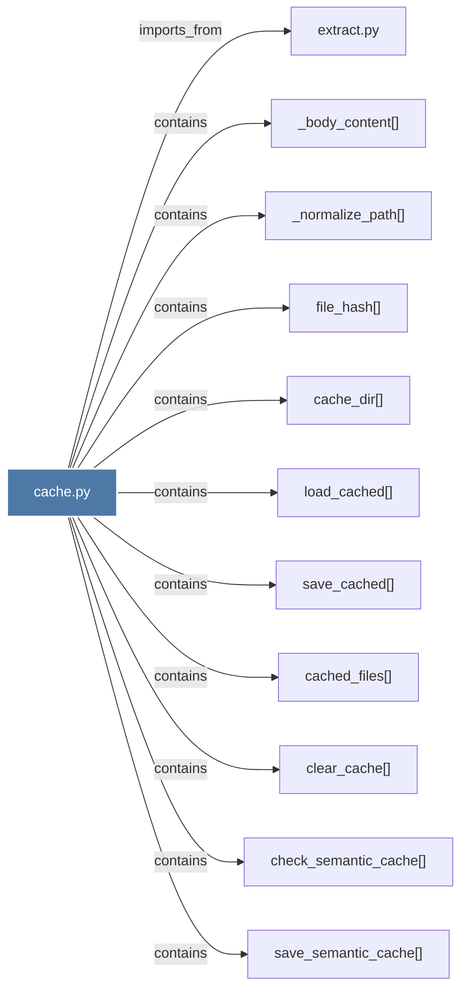

# cache.py

> [!info] Properties
> **File Type**: code
> **Community**: [[_COMMUNITY_Community None|Community None]]
> **Degree**: 11

## Architecture Graph


## Outbound Connections
- [[_body_content()]] - `contains` [EXTRACTED]
- [[_normalize_path()]] - `contains` [EXTRACTED]
- [[cache_dir()]] - `contains` [EXTRACTED]
- [[cached_files()]] - `contains` [EXTRACTED]
- [[check_semantic_cache()]] - `contains` [EXTRACTED]
- [[clear_cache()]] - `contains` [EXTRACTED]
- [[extract.py]] - `imports_from` [EXTRACTED]
- [[file_hash()]] - `contains` [EXTRACTED]
- [[load_cached()]] - `contains` [EXTRACTED]
- [[save_cached()]] - `contains` [EXTRACTED]
- [[save_semantic_cache()]] - `contains` [EXTRACTED]

## Inbound Dependencies
> [!abstract]- Files that link here
```dataview
LIST
FROM [[cache.py]]
```

#graphify/code #graphify/EXTRACTED #community/Community_None