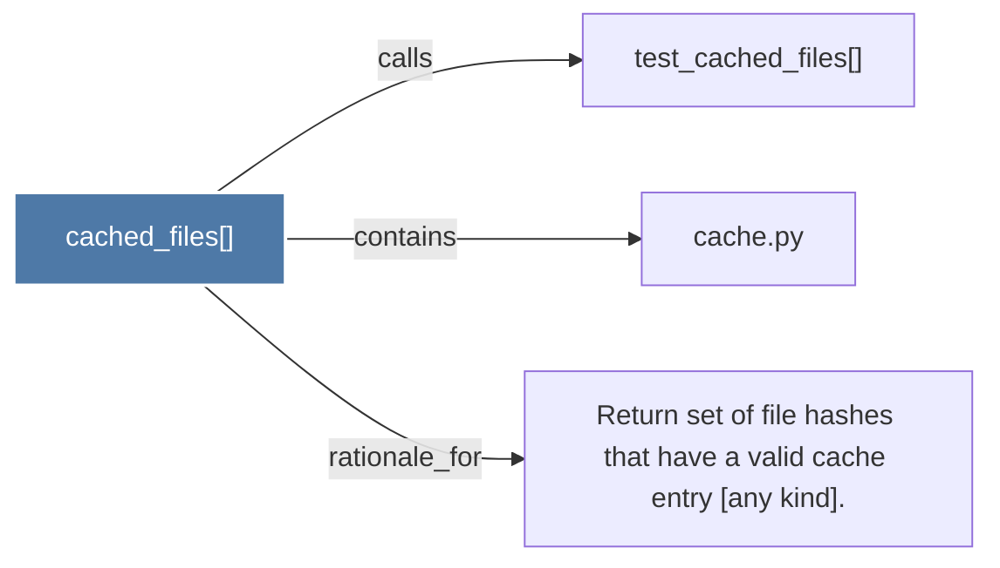

# cached_files()

> [!info] Properties
> **File Type**: code
> **Community**: [[_COMMUNITY_Community None|Community None]]
> **Degree**: 3

## Architecture Graph


## Outbound Connections
- [[Return set of file hashes that have a valid cache entry (any kind).]] - `rationale_for` [EXTRACTED]
- [[cache.py]] - `contains` [EXTRACTED]
- [[test_cached_files()]] - `calls` [INFERRED]

## Inbound Dependencies
> [!abstract]- Files that link here
```dataview
LIST
FROM [[cached_files()]]
```

#graphify/code #graphify/EXTRACTED #community/Community_None