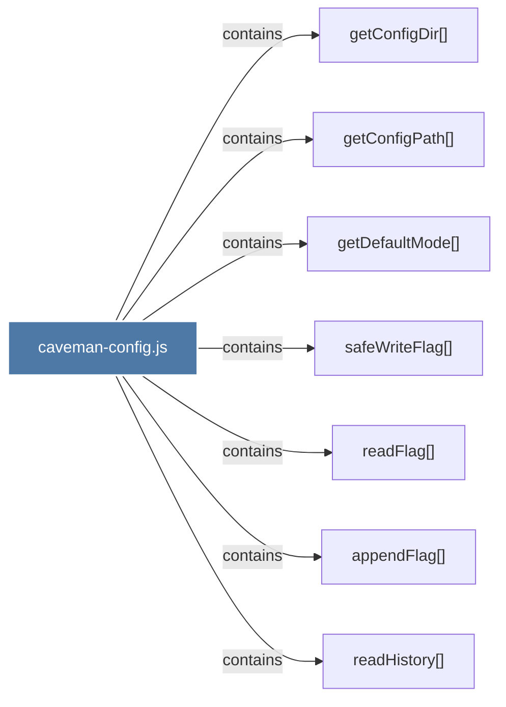

# caveman-config.js

> [!info] Properties
> **File Type**: code
> **Community**: [[_COMMUNITY_Community None|Community None]]
> **Degree**: 7

## Architecture Graph


## Outbound Connections
- [[appendFlag()]] - `contains` [EXTRACTED]
- [[getConfigDir()]] - `contains` [EXTRACTED]
- [[getConfigPath()]] - `contains` [EXTRACTED]
- [[getDefaultMode()]] - `contains` [EXTRACTED]
- [[readFlag()]] - `contains` [EXTRACTED]
- [[readHistory()]] - `contains` [EXTRACTED]
- [[safeWriteFlag()]] - `contains` [EXTRACTED]

## Inbound Dependencies
> [!abstract]- Files that link here
```dataview
LIST
FROM [[caveman-config.js]]
```

#graphify/code #graphify/EXTRACTED #community/Community_None