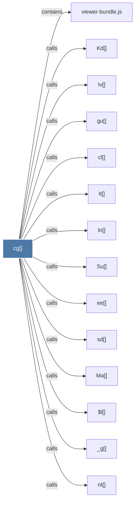

# cg()

> [!info] Properties
> **File Type**: code
> **Community**: [[_COMMUNITY_Community None|Community None]]
> **Degree**: 14

## Architecture Graph


## Outbound Connections
- [[$l()]] - `calls` [EXTRACTED]
- [[It()]] - `calls` [EXTRACTED]
- [[Iv()]] - `calls` [EXTRACTED]
- [[Kd()]] - `calls` [EXTRACTED]
- [[Ma()]] - `calls` [EXTRACTED]
- [[Su()]] - `calls` [EXTRACTED]
- [[_g()]] - `calls` [EXTRACTED]
- [[cl()]] - `calls` [EXTRACTED]
- [[ee()]] - `calls` [EXTRACTED]
- [[gu()]] - `calls` [EXTRACTED]
- [[ln()]] - `calls` [EXTRACTED]
- [[nt()]] - `calls` [EXTRACTED]
- [[sd()]] - `calls` [EXTRACTED]
- [[viewer-bundle.js]] - `contains` [EXTRACTED]

## Inbound Dependencies
> [!abstract]- Files that link here
```dataview
LIST
FROM [[cg()]]
```

#graphify/code #graphify/EXTRACTED #community/Community_None