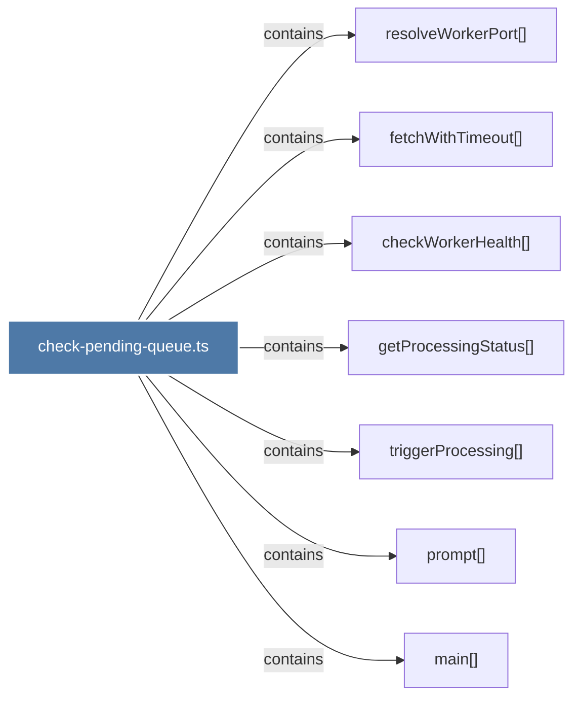

# check-pending-queue.ts

> [!info] Properties
> **File Type**: code
> **Community**: [[_COMMUNITY_Community None|Community None]]
> **Degree**: 7

## Architecture Graph


## Outbound Connections
- [[checkWorkerHealth()]] - `contains` [EXTRACTED]
- [[fetchWithTimeout()_1]] - `contains` [EXTRACTED]
- [[getProcessingStatus()]] - `contains` [EXTRACTED]
- [[main()_35]] - `contains` [EXTRACTED]
- [[prompt()_1]] - `contains` [EXTRACTED]
- [[resolveWorkerPort()_1]] - `contains` [EXTRACTED]
- [[triggerProcessing()]] - `contains` [EXTRACTED]

## Inbound Dependencies
> [!abstract]- Files that link here
```dataview
LIST
FROM [[check-pending-queue.ts]]
```

#graphify/code #graphify/EXTRACTED #community/Community_None