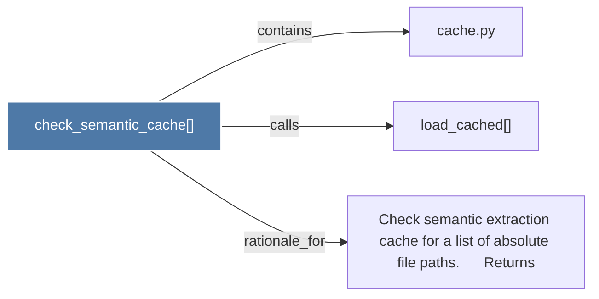

# check_semantic_cache()

> [!info] Properties
> **File Type**: code
> **Community**: [[_COMMUNITY_Community None|Community None]]
> **Degree**: 3

## Architecture Graph


## Outbound Connections
- [[Check semantic extraction cache for a list of absolute file paths.      Returns]] - `rationale_for` [EXTRACTED]
- [[cache.py]] - `contains` [EXTRACTED]
- [[load_cached()]] - `calls` [EXTRACTED]

## Inbound Dependencies
> [!abstract]- Files that link here
```dataview
LIST
FROM [[check_semantic_cache()]]
```

#graphify/code #graphify/EXTRACTED #community/Community_None