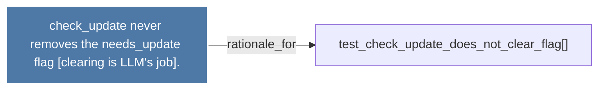

# check_update never removes the needs_update flag (clearing is LLM's job).

> [!info] Properties
> **File Type**: rationale
> **Community**: [[_COMMUNITY_Community None|Community None]]
> **Degree**: 1

## Architecture Graph


## Outbound Connections
- [[test_check_update_does_not_clear_flag()]] - `rationale_for` [EXTRACTED]

## Inbound Dependencies
> [!abstract]- Files that link here
```dataview
LIST
FROM [[check_update never removes the needs_update flag (clearing is LLM's job).]]
```

#graphify/rationale #graphify/EXTRACTED #community/Community_None