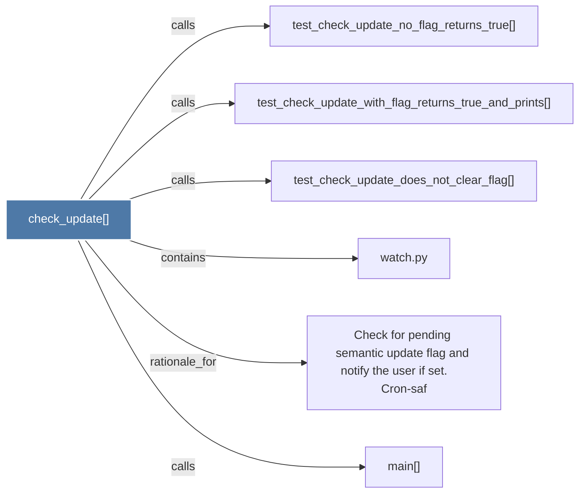

# check_update()

> [!info] Properties
> **File Type**: code
> **Community**: [[_COMMUNITY_Community None|Community None]]
> **Degree**: 6

## Architecture Graph


## Outbound Connections
- [[Check for pending semantic update flag and notify the user if set.      Cron-saf]] - `rationale_for` [EXTRACTED]
- [[main()_2]] - `calls` [INFERRED]
- [[test_check_update_does_not_clear_flag()]] - `calls` [INFERRED]
- [[test_check_update_no_flag_returns_true()]] - `calls` [INFERRED]
- [[test_check_update_with_flag_returns_true_and_prints()]] - `calls` [INFERRED]
- [[watch.py]] - `contains` [EXTRACTED]

## Inbound Dependencies
> [!abstract]- Files that link here
```dataview
LIST
FROM [[check_update()]]
```

#graphify/code #graphify/INFERRED #community/Community_None