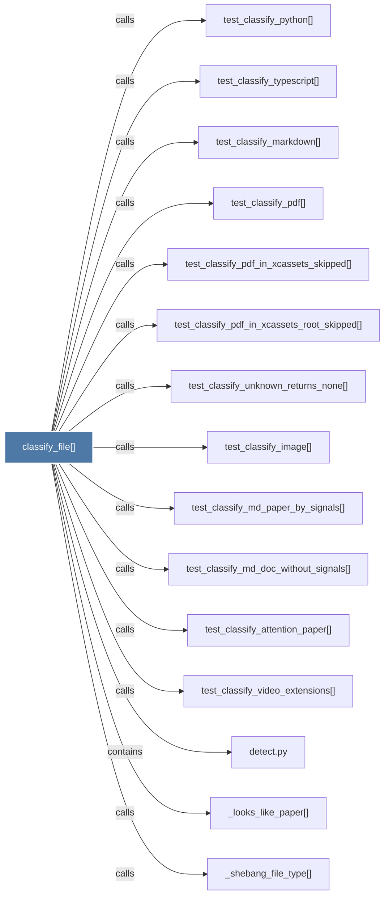

# classify_file()

> [!info] Properties
> **File Type**: code
> **Community**: [[_COMMUNITY_Community None|Community None]]
> **Degree**: 16

## Architecture Graph


## Outbound Connections
- [[_looks_like_paper()]] - `calls` [EXTRACTED]
- [[_shebang_file_type()]] - `calls` [EXTRACTED]
- [[detect()]] - `calls` [EXTRACTED]
- [[detect.py]] - `contains` [EXTRACTED]
- [[test_classify_attention_paper()]] - `calls` [INFERRED]
- [[test_classify_image()]] - `calls` [INFERRED]
- [[test_classify_markdown()]] - `calls` [INFERRED]
- [[test_classify_md_doc_without_signals()]] - `calls` [INFERRED]
- [[test_classify_md_paper_by_signals()]] - `calls` [INFERRED]
- [[test_classify_pdf()]] - `calls` [INFERRED]
- [[test_classify_pdf_in_xcassets_root_skipped()]] - `calls` [INFERRED]
- [[test_classify_pdf_in_xcassets_skipped()]] - `calls` [INFERRED]
- [[test_classify_python()]] - `calls` [INFERRED]
- [[test_classify_typescript()]] - `calls` [INFERRED]
- [[test_classify_unknown_returns_none()]] - `calls` [INFERRED]
- [[test_classify_video_extensions()]] - `calls` [INFERRED]

## Inbound Dependencies
> [!abstract]- Files that link here
```dataview
LIST
FROM [[classify_file()]]
```

#graphify/code #graphify/INFERRED #community/Community_None