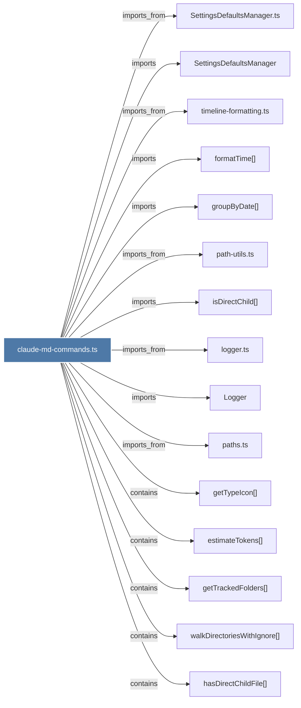

# claude-md-commands.ts

> [!info] Properties
> **File Type**: code
> **Community**: [[_COMMUNITY_Community None|Community None]]
> **Degree**: 26

## Architecture Graph


## Outbound Connections
- [[Logger]] - `imports` [EXTRACTED]
- [[SettingsDefaultsManager]] - `imports` [EXTRACTED]
- [[SettingsDefaultsManager.ts]] - `imports_from` [EXTRACTED]
- [[cleanClaudeMd()]] - `contains` [EXTRACTED]
- [[cleanSingleFile()]] - `contains` [EXTRACTED]
- [[estimateTokens()]] - `contains` [EXTRACTED]
- [[extractRelevantFile()]] - `contains` [EXTRACTED]
- [[findObservationsByFolder()]] - `contains` [EXTRACTED]
- [[formatObservationsForClaudeMd()]] - `contains` [EXTRACTED]
- [[formatTime()_1]] - `imports` [EXTRACTED]
- [[generateClaudeMd()]] - `contains` [EXTRACTED]
- [[getTrackedFolders()]] - `contains` [EXTRACTED]
- [[getTypeIcon()]] - `contains` [EXTRACTED]
- [[groupByDate()]] - `imports` [EXTRACTED]
- [[hasDirectChildFile()]] - `contains` [EXTRACTED]
- [[isDirectChild()]] - `imports` [EXTRACTED]
- [[logger.ts]] - `imports_from` [EXTRACTED]
- [[main()_22]] - `imports_from` [EXTRACTED]
- [[path-utils.ts]] - `imports_from` [EXTRACTED]
- [[paths.ts]] - `imports_from` [EXTRACTED]
- [[processAllFoldersForGeneration()]] - `contains` [EXTRACTED]
- [[processFilesForCleanup()]] - `contains` [EXTRACTED]
- [[regenerateFolder()]] - `contains` [EXTRACTED]
- [[timeline-formatting.ts]] - `imports_from` [EXTRACTED]
- [[walkDirectoriesWithIgnore()]] - `contains` [EXTRACTED]
- [[writeClaudeMdToFolder()]] - `contains` [EXTRACTED]

## Inbound Dependencies
> [!abstract]- Files that link here
```dataview
LIST
FROM [[claude-md-commands.ts]]
```

#graphify/code #graphify/EXTRACTED #community/Community_None