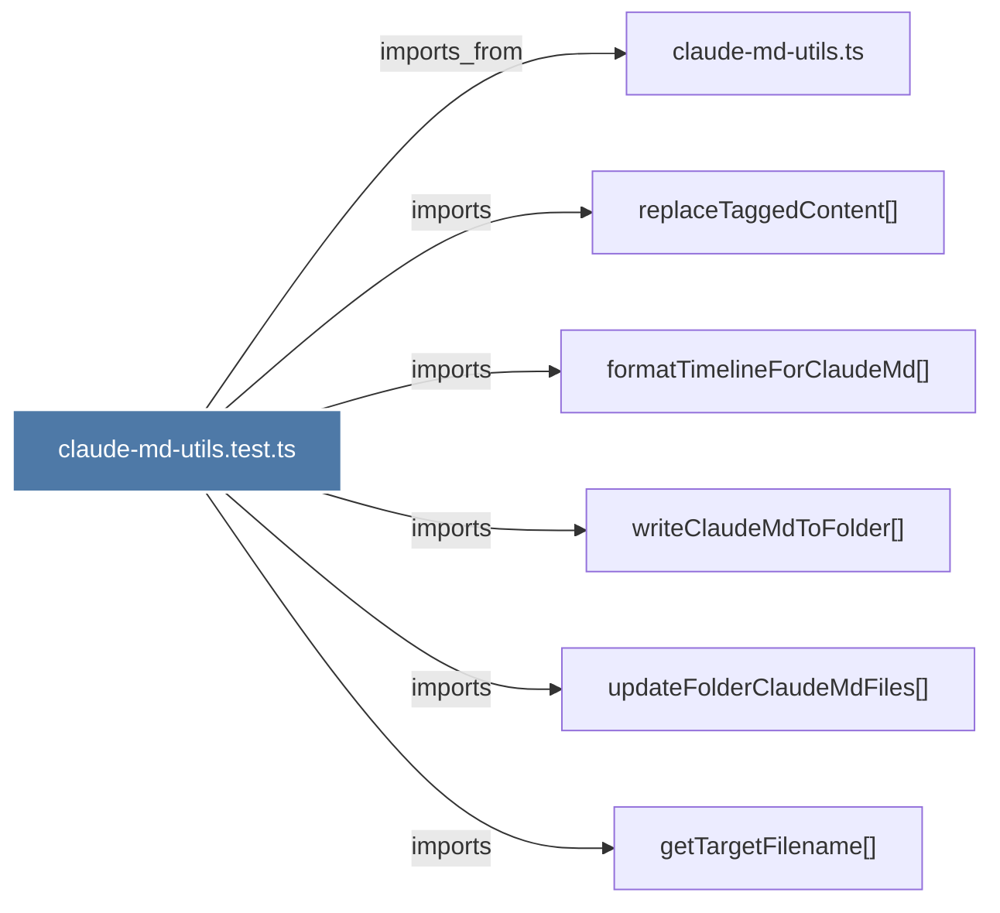

# claude-md-utils.test.ts

> [!info] Properties
> **File Type**: code
> **Community**: [[_COMMUNITY_Community None|Community None]]
> **Degree**: 6

## Architecture Graph


## Outbound Connections
- [[claude-md-utils.ts]] - `imports_from` [EXTRACTED]
- [[formatTimelineForClaudeMd()]] - `imports` [EXTRACTED]
- [[getTargetFilename()]] - `imports` [EXTRACTED]
- [[replaceTaggedContent()]] - `imports` [EXTRACTED]
- [[updateFolderClaudeMdFiles()]] - `imports` [EXTRACTED]
- [[writeClaudeMdToFolder()_1]] - `imports` [EXTRACTED]

## Inbound Dependencies
> [!abstract]- Files that link here
```dataview
LIST
FROM [[claude-md-utils.test.ts]]
```

#graphify/code #graphify/EXTRACTED #community/Community_None