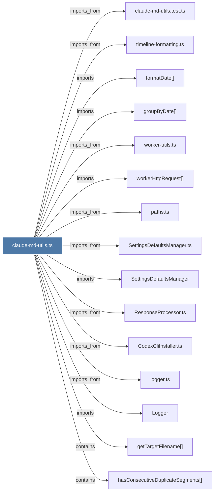

# claude-md-utils.ts

> [!info] Properties
> **File Type**: code
> **Community**: [[_COMMUNITY_Community None|Community None]]
> **Degree**: 25

## Architecture Graph


## Outbound Connections
- [[CodexCliInstaller.ts]] - `imports_from` [EXTRACTED]
- [[Logger]] - `imports` [EXTRACTED]
- [[ResponseProcessor.ts]] - `imports_from` [EXTRACTED]
- [[SettingsDefaultsManager]] - `imports` [EXTRACTED]
- [[SettingsDefaultsManager.ts]] - `imports_from` [EXTRACTED]
- [[agents-md-utils.ts]] - `imports_from` [EXTRACTED]
- [[claude-md-utils.test.ts]] - `imports_from` [EXTRACTED]
- [[formatDate()_1]] - `imports` [EXTRACTED]
- [[formatTimelineForClaudeMd()]] - `contains` [EXTRACTED]
- [[getTargetFilename()]] - `contains` [EXTRACTED]
- [[groupByDate()]] - `imports` [EXTRACTED]
- [[hasConsecutiveDuplicateSegments()]] - `contains` [EXTRACTED]
- [[isExcludedFolder()]] - `contains` [EXTRACTED]
- [[isExcludedUnsafeDirectory()]] - `contains` [EXTRACTED]
- [[isProjectRoot()]] - `contains` [EXTRACTED]
- [[isValidPathForClaudeMd()]] - `contains` [EXTRACTED]
- [[logger.ts]] - `imports_from` [EXTRACTED]
- [[paths.ts]] - `imports_from` [EXTRACTED]
- [[regenerate-claude-md.ts]] - `imports_from` [EXTRACTED]
- [[replaceTaggedContent()]] - `contains` [EXTRACTED]
- [[timeline-formatting.ts]] - `imports_from` [EXTRACTED]
- [[updateFolderClaudeMdFiles()]] - `contains` [EXTRACTED]
- [[worker-utils.ts]] - `imports_from` [EXTRACTED]
- [[workerHttpRequest()]] - `imports` [EXTRACTED]
- [[writeClaudeMdToFolder()_1]] - `contains` [EXTRACTED]

## Inbound Dependencies
> [!abstract]- Files that link here
```dataview
LIST
FROM [[claude-md-utils.ts]]
```

#graphify/code #graphify/EXTRACTED #community/Community_None