# claudeSettingsPath()

> [!info] Properties
> **File Type**: code
> **Community**: [[_COMMUNITY_Community None|Community None]]
> **Degree**: 6

## Architecture Graph

```mermaid
graph LR
    center["claudeSettingsPath[]"]:::centerNode
    center -->|"imports"| N_vendor_claude_mem_src_npx_cli_commands_install_ts["install.ts"]
    center -->|"calls"| N_commands_install_enableplugininclaudesettings["enablePluginInClaudeSettings[]"]
    center -->|"imports"| N_vendor_claude_mem_src_npx_cli_commands_uninstall_ts["uninstall.ts"]
    center -->|"calls"| N_commands_uninstall_removefromclaudesettings["removeFromClaudeSettings[]"]
    center -->|"contains"| N_vendor_claude_mem_src_npx_cli_utils_paths_ts["paths.ts"]
    center -->|"calls"| N_utils_paths_claudeconfigdirectory["claudeConfigDirectory[]"]
    classDef centerNode fill:#4E79A7,stroke:#fff,stroke-width:2px,color:#fff
```


## Outbound Connections
- [[claudeConfigDirectory()]] - `calls` [EXTRACTED]
- [[enablePluginInClaudeSettings()]] - `calls` [INFERRED]
- [[install.ts]] - `imports` [EXTRACTED]
- [[paths.ts_1]] - `contains` [EXTRACTED]
- [[removeFromClaudeSettings()]] - `calls` [INFERRED]
- [[uninstall.ts]] - `imports` [EXTRACTED]

## Inbound Dependencies
> [!abstract]- Files that link here
```dataview
LIST
FROM [[claudeSettingsPath()]]
```

#graphify/code #graphify/EXTRACTED #community/Community_None