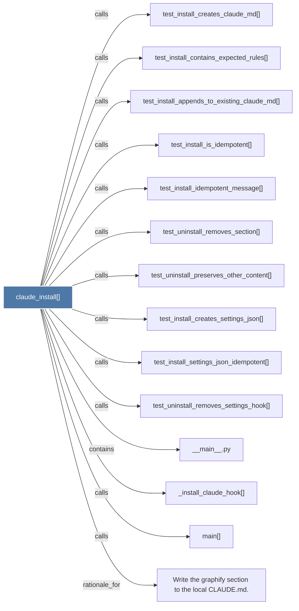

# claude_install()

> [!info] Properties
> **File Type**: code
> **Community**: [[_COMMUNITY_Community None|Community None]]
> **Degree**: 14

## Architecture Graph


## Outbound Connections
- [[Write the graphify section to the local CLAUDE.md.]] - `rationale_for` [EXTRACTED]
- [[__main__.py]] - `contains` [EXTRACTED]
- [[_install_claude_hook()]] - `calls` [EXTRACTED]
- [[main()_2]] - `calls` [EXTRACTED]
- [[test_install_appends_to_existing_claude_md()]] - `calls` [INFERRED]
- [[test_install_contains_expected_rules()]] - `calls` [INFERRED]
- [[test_install_creates_claude_md()]] - `calls` [INFERRED]
- [[test_install_creates_settings_json()]] - `calls` [INFERRED]
- [[test_install_idempotent_message()]] - `calls` [INFERRED]
- [[test_install_is_idempotent()]] - `calls` [INFERRED]
- [[test_install_settings_json_idempotent()]] - `calls` [INFERRED]
- [[test_uninstall_preserves_other_content()]] - `calls` [INFERRED]
- [[test_uninstall_removes_section()]] - `calls` [INFERRED]
- [[test_uninstall_removes_settings_hook()]] - `calls` [INFERRED]

## Inbound Dependencies
> [!abstract]- Files that link here
```dataview
LIST
FROM [[claude_install()]]
```

#graphify/code #graphify/INFERRED #community/Community_None