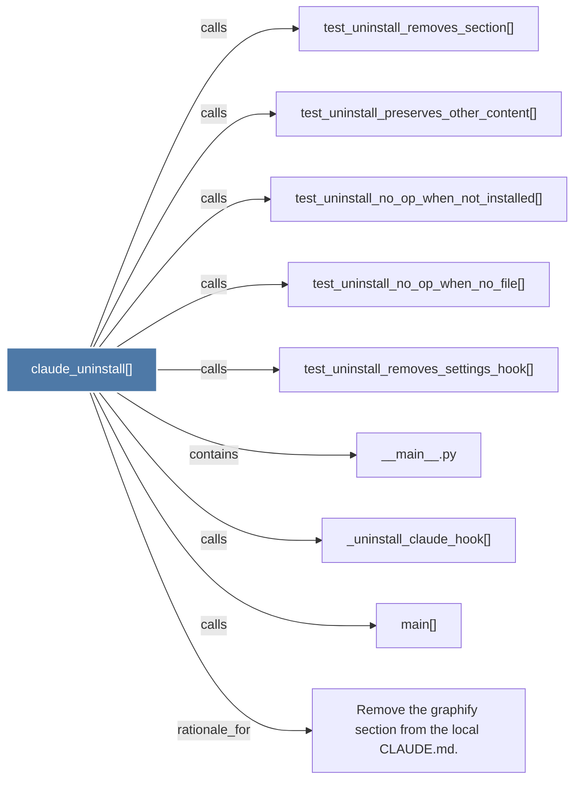

# claude_uninstall()

> [!info] Properties
> **File Type**: code
> **Community**: [[_COMMUNITY_Community None|Community None]]
> **Degree**: 9

## Architecture Graph


## Outbound Connections
- [[Remove the graphify section from the local CLAUDE.md.]] - `rationale_for` [EXTRACTED]
- [[__main__.py]] - `contains` [EXTRACTED]
- [[_uninstall_claude_hook()]] - `calls` [EXTRACTED]
- [[main()_2]] - `calls` [EXTRACTED]
- [[test_uninstall_no_op_when_no_file()]] - `calls` [INFERRED]
- [[test_uninstall_no_op_when_not_installed()]] - `calls` [INFERRED]
- [[test_uninstall_preserves_other_content()]] - `calls` [INFERRED]
- [[test_uninstall_removes_section()]] - `calls` [INFERRED]
- [[test_uninstall_removes_settings_hook()]] - `calls` [INFERRED]

## Inbound Dependencies
> [!abstract]- Files that link here
```dataview
LIST
FROM [[claude_uninstall()]]
```

#graphify/code #graphify/INFERRED #community/Community_None