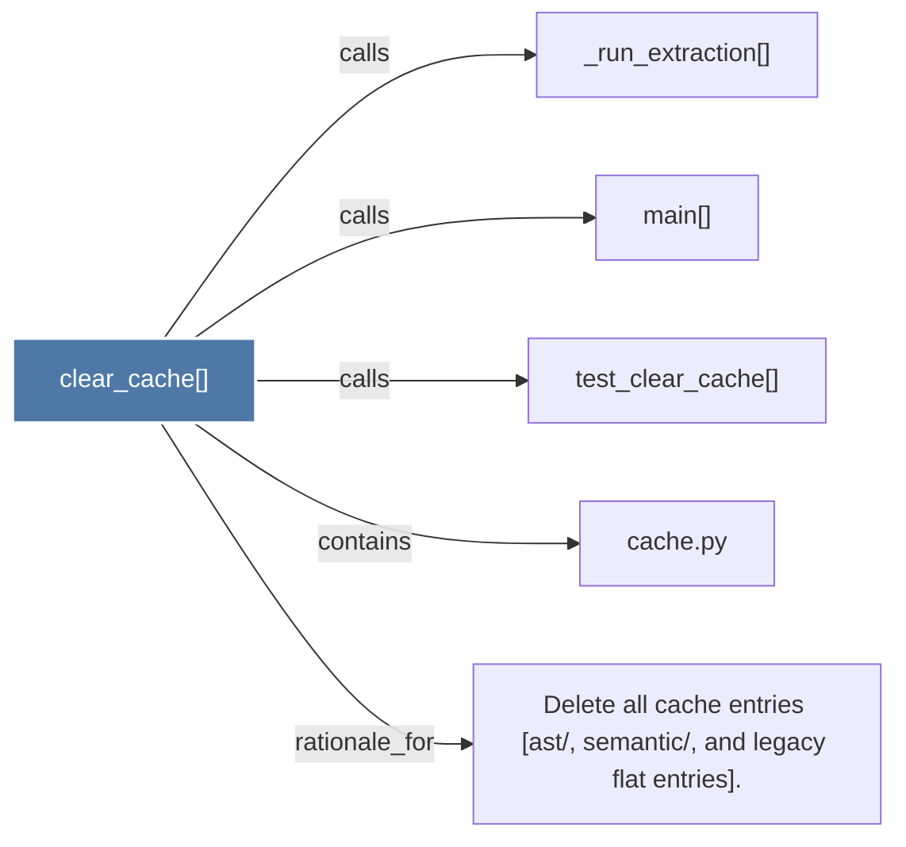

# clear_cache()

> [!info] Properties
> **File Type**: code
> **Community**: [[_COMMUNITY_Community None|Community None]]
> **Degree**: 5

## Architecture Graph


## Outbound Connections
- [[Delete all cache entries (ast, semantic, and legacy flat entries).]] - `rationale_for` [EXTRACTED]
- [[_run_extraction()]] - `calls` [INFERRED]
- [[cache.py]] - `contains` [EXTRACTED]
- [[main()]] - `calls` [INFERRED]
- [[test_clear_cache()]] - `calls` [INFERRED]

## Inbound Dependencies
> [!abstract]- Files that link here
```dataview
LIST
FROM [[clear_cache()]]
```

#graphify/code #graphify/INFERRED #community/Community_None