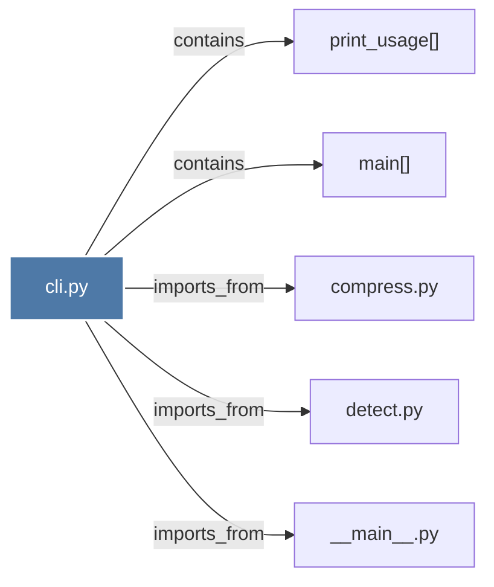

# cli.py

> [!info] Properties
> **File Type**: code
> **Community**: [[_COMMUNITY_Community None|Community None]]
> **Degree**: 5

## Architecture Graph


## Outbound Connections
- [[__main__.py_3]] - `imports_from` [EXTRACTED]
- [[compress.py_2]] - `imports_from` [EXTRACTED]
- [[detect.py_3]] - `imports_from` [EXTRACTED]
- [[main()_12]] - `contains` [EXTRACTED]
- [[print_usage()]] - `contains` [EXTRACTED]

## Inbound Dependencies
> [!abstract]- Files that link here
```dataview
LIST
FROM [[cli.py_2]]
```

#graphify/code #graphify/EXTRACTED #community/Community_None