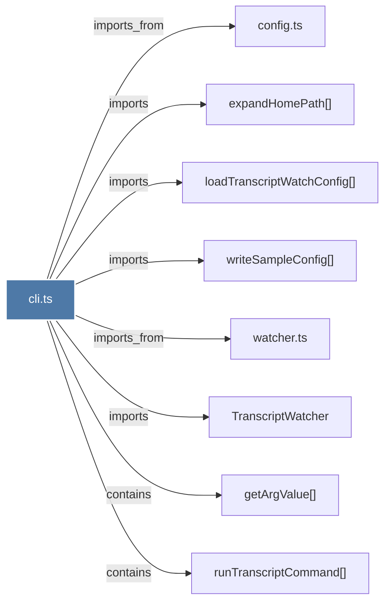

# cli.ts

> [!info] Properties
> **File Type**: code
> **Community**: [[_COMMUNITY_Community None|Community None]]
> **Degree**: 8

## Architecture Graph


## Outbound Connections
- [[TranscriptWatcher]] - `imports` [EXTRACTED]
- [[config.ts]] - `imports_from` [EXTRACTED]
- [[expandHomePath()]] - `imports` [EXTRACTED]
- [[getArgValue()]] - `contains` [EXTRACTED]
- [[loadTranscriptWatchConfig()]] - `imports` [EXTRACTED]
- [[runTranscriptCommand()]] - `contains` [EXTRACTED]
- [[watcher.ts]] - `imports_from` [EXTRACTED]
- [[writeSampleConfig()]] - `imports` [EXTRACTED]

## Inbound Dependencies
> [!abstract]- Files that link here
```dataview
LIST
FROM [[cli.ts]]
```

#graphify/code #graphify/EXTRACTED #community/Community_None