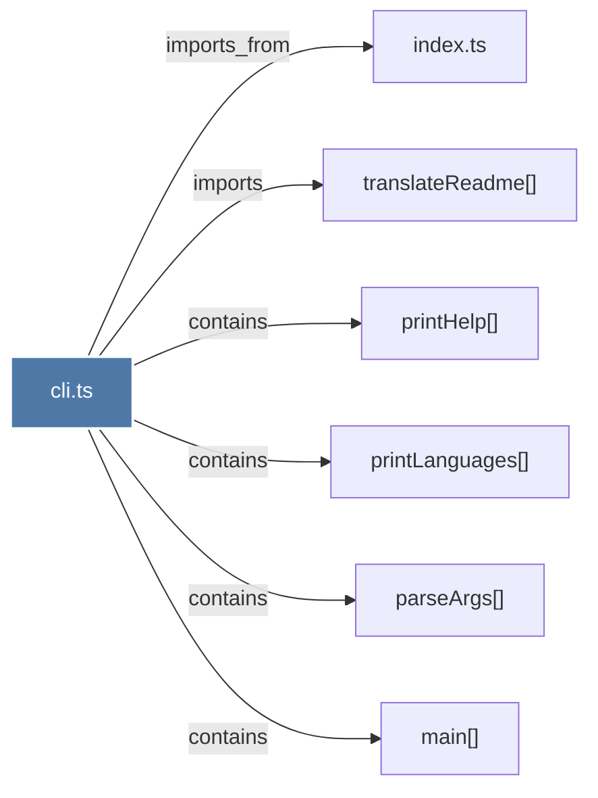

# cli.ts

> [!info] Properties
> **File Type**: code
> **Community**: [[_COMMUNITY_Community None|Community None]]
> **Degree**: 6

## Architecture Graph


## Outbound Connections
- [[index.ts_14]] - `imports_from` [EXTRACTED]
- [[main()_43]] - `contains` [EXTRACTED]
- [[parseArgs()_3]] - `contains` [EXTRACTED]
- [[printHelp()_3]] - `contains` [EXTRACTED]
- [[printLanguages()]] - `contains` [EXTRACTED]
- [[translateReadme()]] - `imports` [EXTRACTED]

## Inbound Dependencies
> [!abstract]- Files that link here
```dataview
LIST
FROM [[cli.ts_2]]
```

#graphify/code #graphify/EXTRACTED #community/Community_None