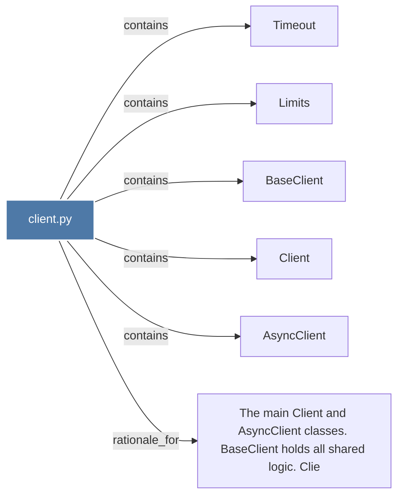

# client.py

> [!info] Properties
> **File Type**: code
> **Community**: [[_COMMUNITY_Community None|Community None]]
> **Degree**: 6

## Architecture Graph


## Outbound Connections
- [[AsyncClient]] - `contains` [EXTRACTED]
- [[BaseClient]] - `contains` [EXTRACTED]
- [[Client]] - `contains` [EXTRACTED]
- [[Limits]] - `contains` [EXTRACTED]
- [[The main Client and AsyncClient classes. BaseClient holds all shared logic. Clie]] - `rationale_for` [EXTRACTED]
- [[Timeout]] - `contains` [EXTRACTED]

## Inbound Dependencies
> [!abstract]- Files that link here
```dataview
LIST
FROM [[client.py]]
```

#graphify/code #graphify/EXTRACTED #community/Community_None