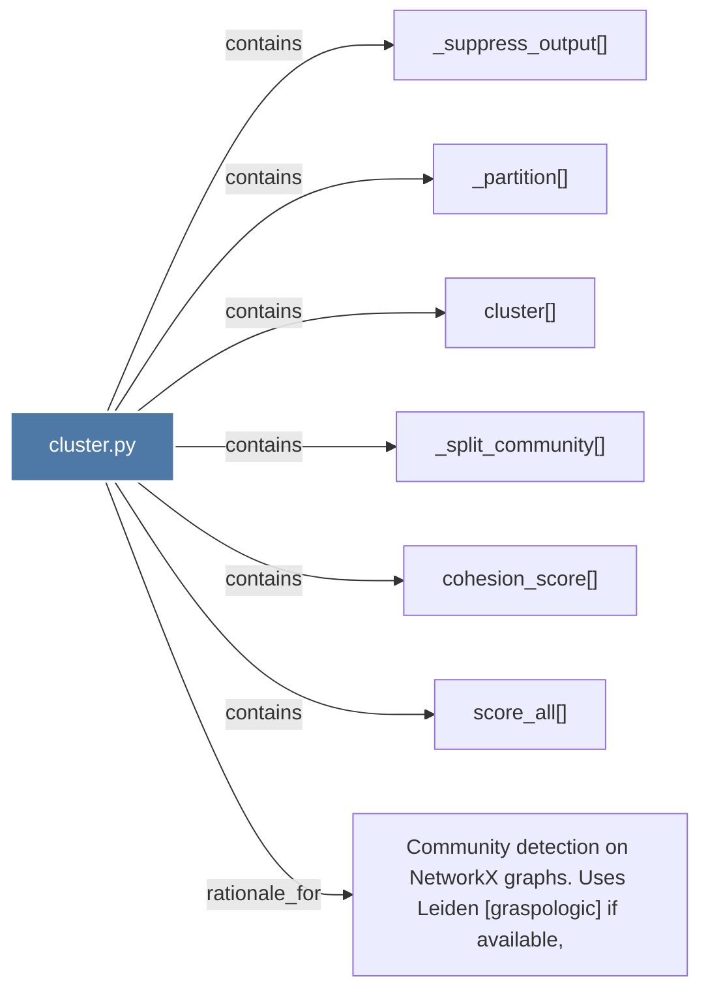

# cluster.py

> [!info] Properties
> **File Type**: code
> **Community**: [[_COMMUNITY_Community None|Community None]]
> **Degree**: 7

## Architecture Graph


## Outbound Connections
- [[Community detection on NetworkX graphs. Uses Leiden (graspologic) if available,]] - `rationale_for` [EXTRACTED]
- [[_partition()]] - `contains` [EXTRACTED]
- [[_split_community()]] - `contains` [EXTRACTED]
- [[_suppress_output()]] - `contains` [EXTRACTED]
- [[cluster()]] - `contains` [EXTRACTED]
- [[cohesion_score()]] - `contains` [EXTRACTED]
- [[score_all()]] - `contains` [EXTRACTED]

## Inbound Dependencies
> [!abstract]- Files that link here
```dataview
LIST
FROM [[cluster.py]]
```

#graphify/code #graphify/EXTRACTED #community/Community_None