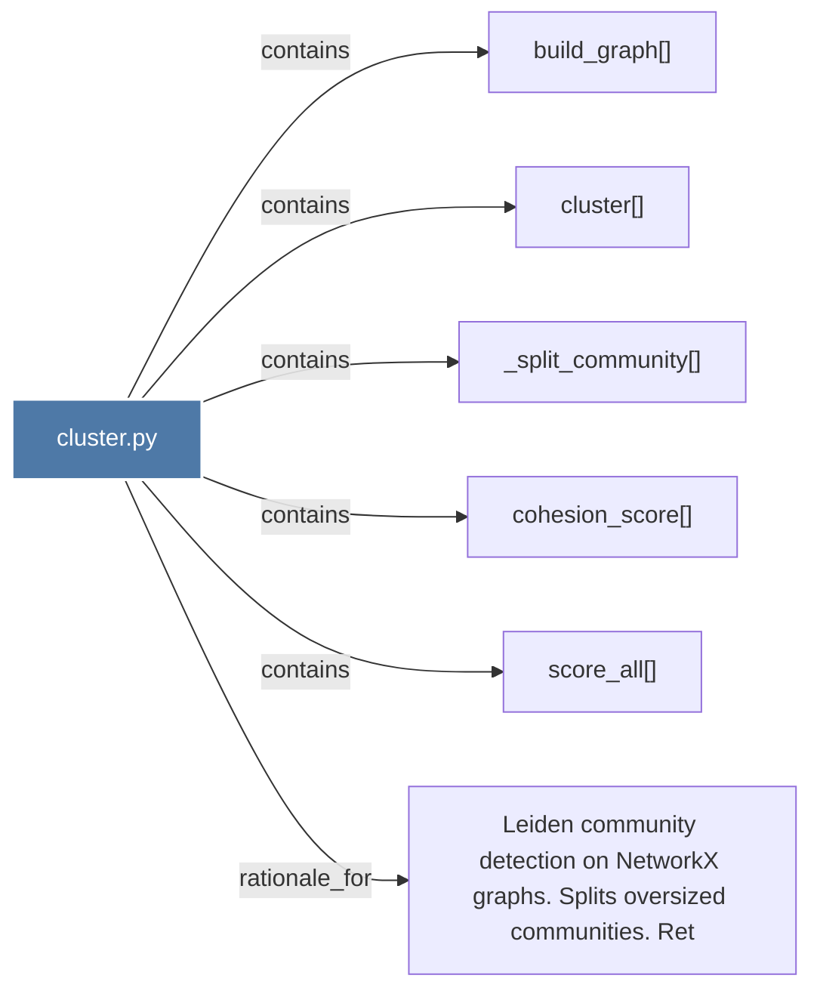

# cluster.py

> [!info] Properties
> **File Type**: code
> **Community**: [[_COMMUNITY_Community None|Community None]]
> **Degree**: 6

## Architecture Graph


## Outbound Connections
- [[Leiden community detection on NetworkX graphs. Splits oversized communities. Ret]] - `rationale_for` [EXTRACTED]
- [[_split_community()_1]] - `contains` [EXTRACTED]
- [[build_graph()_1]] - `contains` [EXTRACTED]
- [[cluster()_1]] - `contains` [EXTRACTED]
- [[cohesion_score()_1]] - `contains` [EXTRACTED]
- [[score_all()_1]] - `contains` [EXTRACTED]

## Inbound Dependencies
> [!abstract]- Files that link here
```dataview
LIST
FROM [[cluster.py_1]]
```

#graphify/code #graphify/EXTRACTED #community/Community_None