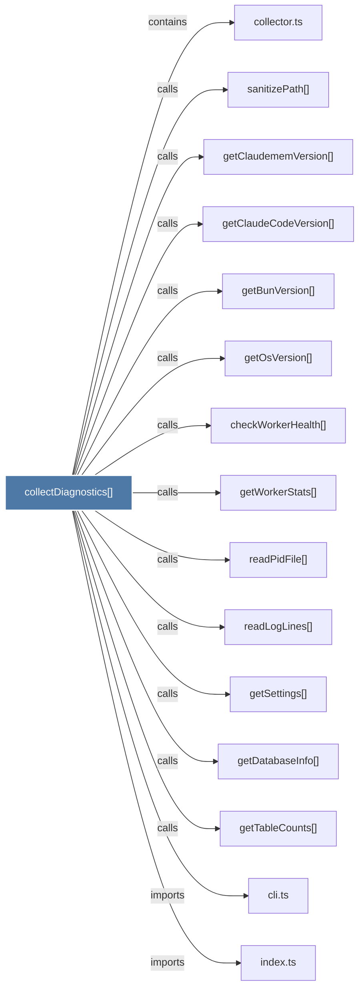

# collectDiagnostics()

> [!info] Properties
> **File Type**: code
> **Community**: [[_COMMUNITY_Community None|Community None]]
> **Degree**: 18

## Architecture Graph


## Outbound Connections
- [[checkWorkerHealth()_1]] - `calls` [EXTRACTED]
- [[cli.ts_1]] - `imports` [EXTRACTED]
- [[collector.ts]] - `contains` [EXTRACTED]
- [[generateBugReport()]] - `calls` [INFERRED]
- [[generateTemplateFallback()]] - `calls` [INFERRED]
- [[getBunVersion()_1]] - `calls` [EXTRACTED]
- [[getClaudeCodeVersion()]] - `calls` [EXTRACTED]
- [[getClaudememVersion()]] - `calls` [EXTRACTED]
- [[getDatabaseInfo()]] - `calls` [EXTRACTED]
- [[getOsVersion()]] - `calls` [EXTRACTED]
- [[getSettings()]] - `calls` [EXTRACTED]
- [[getTableCounts()]] - `calls` [EXTRACTED]
- [[getWorkerStats()]] - `calls` [EXTRACTED]
- [[index.ts_13]] - `imports` [EXTRACTED]
- [[main()_42]] - `calls` [INFERRED]
- [[readLogLines()]] - `calls` [EXTRACTED]
- [[readPidFile()_1]] - `calls` [EXTRACTED]
- [[sanitizePath()]] - `calls` [EXTRACTED]

## Inbound Dependencies
> [!abstract]- Files that link here
```dataview
LIST
FROM [[collectDiagnostics()]]
```

#graphify/code #graphify/EXTRACTED #community/Community_None