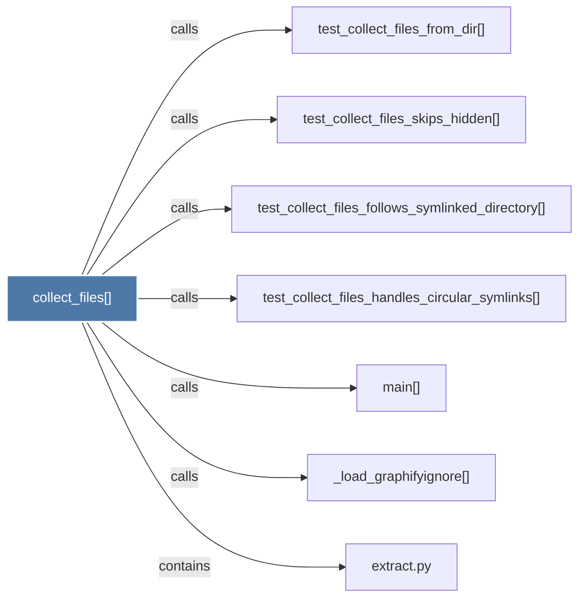

# collect_files()

> [!info] Properties
> **File Type**: code
> **Community**: [[_COMMUNITY_Community None|Community None]]
> **Degree**: 7

## Architecture Graph


## Outbound Connections
- [[_load_graphifyignore()]] - `calls` [INFERRED]
- [[extract.py]] - `contains` [EXTRACTED]
- [[main()]] - `calls` [INFERRED]
- [[test_collect_files_follows_symlinked_directory()]] - `calls` [INFERRED]
- [[test_collect_files_from_dir()]] - `calls` [INFERRED]
- [[test_collect_files_handles_circular_symlinks()]] - `calls` [INFERRED]
- [[test_collect_files_skips_hidden()]] - `calls` [INFERRED]

## Inbound Dependencies
> [!abstract]- Files that link here
```dataview
LIST
FROM [[collect_files()]]
```

#graphify/code #graphify/INFERRED #community/Community_None