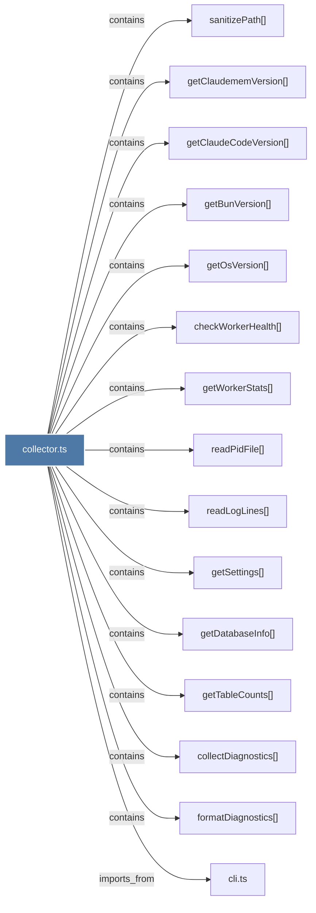

# collector.ts

> [!info] Properties
> **File Type**: code
> **Community**: [[_COMMUNITY_Community None|Community None]]
> **Degree**: 16

## Architecture Graph


## Outbound Connections
- [[checkWorkerHealth()_1]] - `contains` [EXTRACTED]
- [[cli.ts_1]] - `imports_from` [EXTRACTED]
- [[collectDiagnostics()]] - `contains` [EXTRACTED]
- [[formatDiagnostics()]] - `contains` [EXTRACTED]
- [[getBunVersion()_1]] - `contains` [EXTRACTED]
- [[getClaudeCodeVersion()]] - `contains` [EXTRACTED]
- [[getClaudememVersion()]] - `contains` [EXTRACTED]
- [[getDatabaseInfo()]] - `contains` [EXTRACTED]
- [[getOsVersion()]] - `contains` [EXTRACTED]
- [[getSettings()]] - `contains` [EXTRACTED]
- [[getTableCounts()]] - `contains` [EXTRACTED]
- [[getWorkerStats()]] - `contains` [EXTRACTED]
- [[index.ts_13]] - `imports_from` [EXTRACTED]
- [[readLogLines()]] - `contains` [EXTRACTED]
- [[readPidFile()_1]] - `contains` [EXTRACTED]
- [[sanitizePath()]] - `contains` [EXTRACTED]

## Inbound Dependencies
> [!abstract]- Files that link here
```dataview
LIST
FROM [[collector.ts]]
```

#graphify/code #graphify/EXTRACTED #community/Community_None