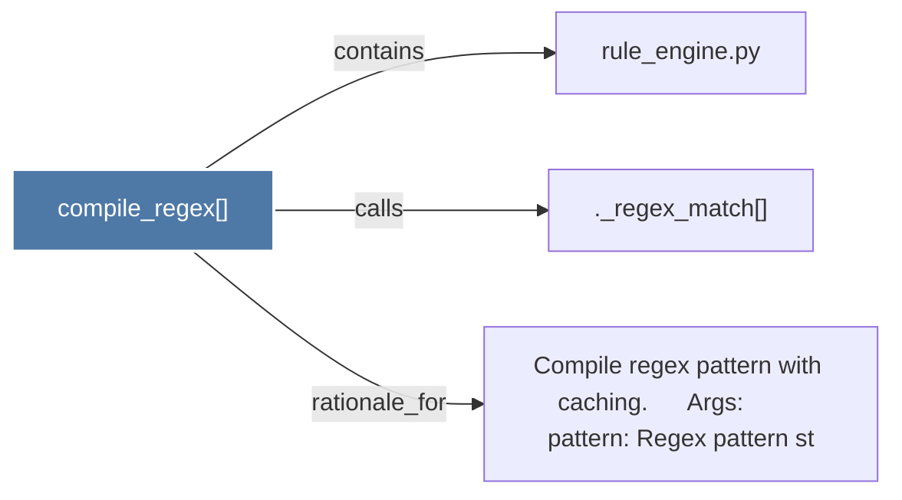

# compile_regex()

> [!info] Properties
> **File Type**: code
> **Community**: [[_COMMUNITY_Community None|Community None]]
> **Degree**: 3

## Architecture Graph


## Outbound Connections
- [[._regex_match()]] - `calls` [EXTRACTED]
- [[Compile regex pattern with caching.      Args         pattern Regex pattern st]] - `rationale_for` [EXTRACTED]
- [[rule_engine.py]] - `contains` [EXTRACTED]

## Inbound Dependencies
> [!abstract]- Files that link here
```dataview
LIST
FROM [[compile_regex()]]
```

#graphify/code #graphify/EXTRACTED #community/Community_None