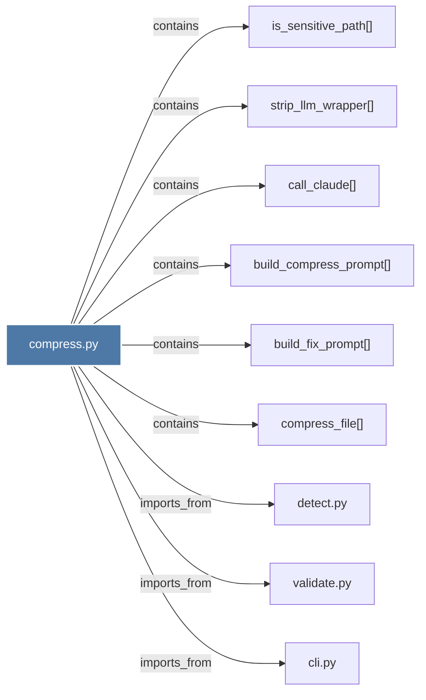

# compress.py

> [!info] Properties
> **File Type**: code
> **Community**: [[_COMMUNITY_Community None|Community None]]
> **Degree**: 9

## Architecture Graph


## Outbound Connections
- [[build_compress_prompt()]] - `contains` [EXTRACTED]
- [[build_fix_prompt()]] - `contains` [EXTRACTED]
- [[call_claude()]] - `contains` [EXTRACTED]
- [[cli.py_1]] - `imports_from` [EXTRACTED]
- [[compress_file()]] - `contains` [EXTRACTED]
- [[detect.py_2]] - `imports_from` [EXTRACTED]
- [[is_sensitive_path()]] - `contains` [EXTRACTED]
- [[strip_llm_wrapper()]] - `contains` [EXTRACTED]
- [[validate.py_2]] - `imports_from` [EXTRACTED]

## Inbound Dependencies
> [!abstract]- Files that link here
```dataview
LIST
FROM [[compress.py_1]]
```

#graphify/code #graphify/EXTRACTED #community/Community_None