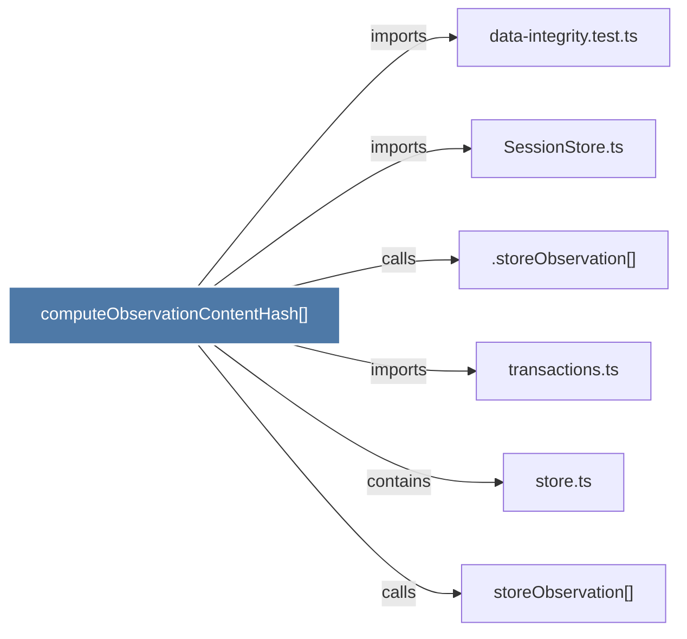

# computeObservationContentHash()

> [!info] Properties
> **File Type**: code
> **Community**: [[_COMMUNITY_Community None|Community None]]
> **Degree**: 6

## Architecture Graph


## Outbound Connections
- [[.storeObservation()]] - `calls` [INFERRED]
- [[SessionStore.ts]] - `imports` [EXTRACTED]
- [[data-integrity.test.ts]] - `imports` [EXTRACTED]
- [[store.ts]] - `contains` [EXTRACTED]
- [[storeObservation()]] - `calls` [EXTRACTED]
- [[transactions.ts]] - `imports` [EXTRACTED]

## Inbound Dependencies
> [!abstract]- Files that link here
```dataview
LIST
FROM [[computeObservationContentHash()]]
```

#graphify/code #graphify/EXTRACTED #community/Community_None