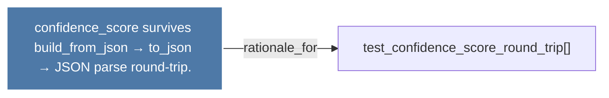

# confidence_score survives build_from_json → to_json → JSON parse round-trip.

> [!info] Properties
> **File Type**: rationale
> **Community**: [[_COMMUNITY_Community None|Community None]]
> **Degree**: 1

## Architecture Graph


## Outbound Connections
- [[test_confidence_score_round_trip()]] - `rationale_for` [EXTRACTED]

## Inbound Dependencies
> [!abstract]- Files that link here
```dataview
LIST
FROM [[confidence_score survives build_from_json → to_json → JSON parse round-trip.]]
```

#graphify/rationale #graphify/EXTRACTED #community/Community_None