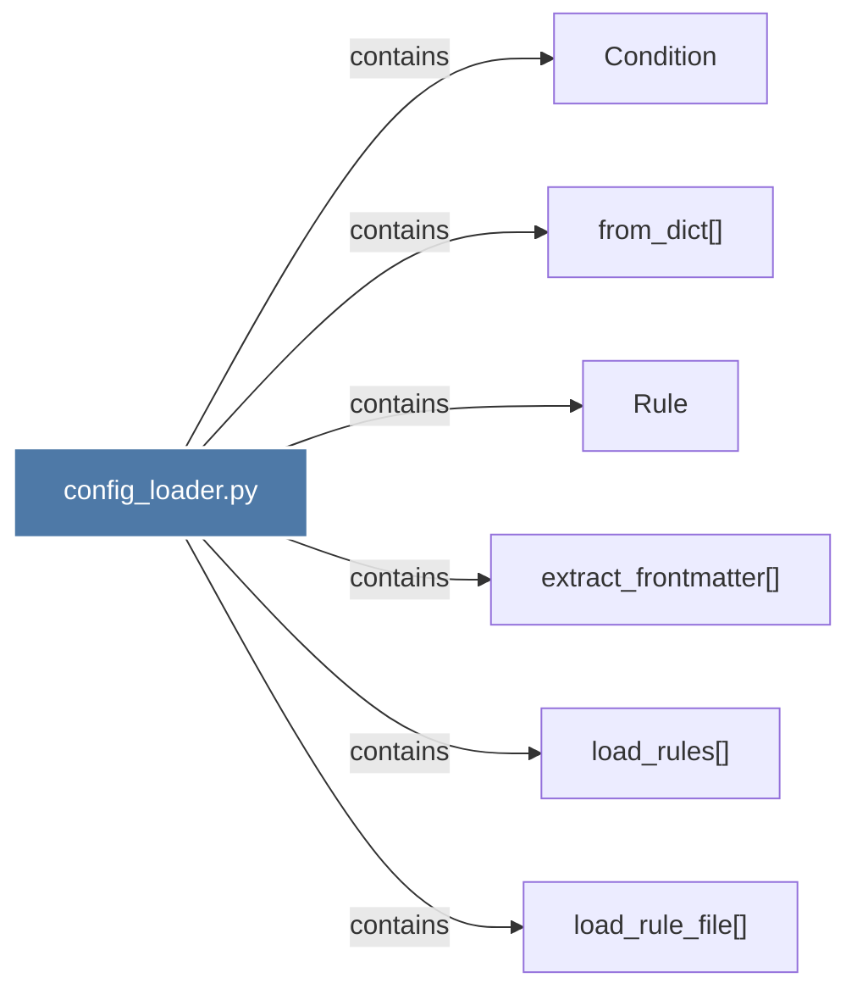

# config_loader.py

> [!info] Properties
> **File Type**: code
> **Community**: [[_COMMUNITY_Community None|Community None]]
> **Degree**: 6

## Architecture Graph


## Outbound Connections
- [[Condition]] - `contains` [EXTRACTED]
- [[Rule]] - `contains` [EXTRACTED]
- [[extract_frontmatter()]] - `contains` [EXTRACTED]
- [[from_dict()]] - `contains` [EXTRACTED]
- [[load_rule_file()]] - `contains` [EXTRACTED]
- [[load_rules()]] - `contains` [EXTRACTED]

## Inbound Dependencies
> [!abstract]- Files that link here
```dataview
LIST
FROM [[config_loader.py]]
```

#graphify/code #graphify/EXTRACTED #community/Community_None