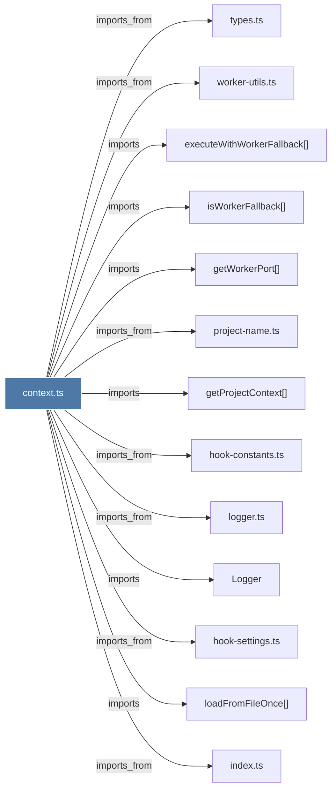

# context.ts

> [!info] Properties
> **File Type**: code
> **Community**: [[_COMMUNITY_Community None|Community None]]
> **Degree**: 13

## Architecture Graph


## Outbound Connections
- [[Logger]] - `imports` [EXTRACTED]
- [[executeWithWorkerFallback()]] - `imports` [EXTRACTED]
- [[getProjectContext()]] - `imports` [EXTRACTED]
- [[getWorkerPort()]] - `imports` [EXTRACTED]
- [[hook-constants.ts]] - `imports_from` [EXTRACTED]
- [[hook-settings.ts]] - `imports_from` [EXTRACTED]
- [[index.ts_2]] - `imports_from` [EXTRACTED]
- [[isWorkerFallback()]] - `imports` [EXTRACTED]
- [[loadFromFileOnce()]] - `imports` [EXTRACTED]
- [[logger.ts]] - `imports_from` [EXTRACTED]
- [[project-name.ts]] - `imports_from` [EXTRACTED]
- [[types.ts]] - `imports_from` [EXTRACTED]
- [[worker-utils.ts]] - `imports_from` [EXTRACTED]

## Inbound Dependencies
> [!abstract]- Files that link here
```dataview
LIST
FROM [[context.ts]]
```

#graphify/code #graphify/EXTRACTED #community/Community_None