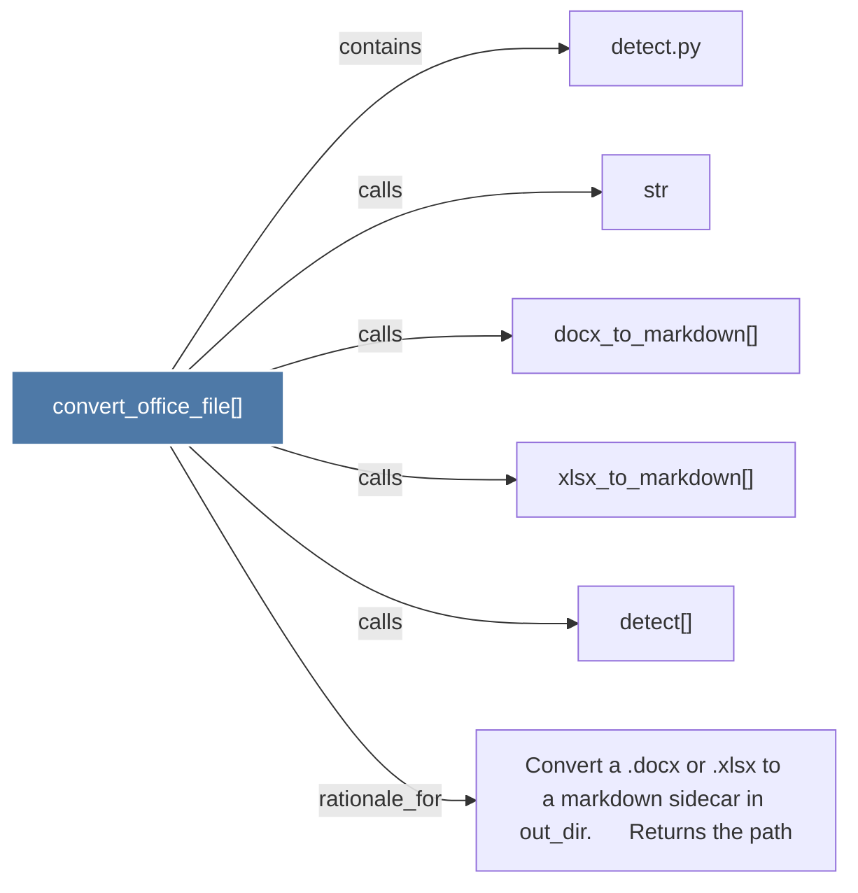

# convert_office_file()

> [!info] Properties
> **File Type**: code
> **Community**: [[_COMMUNITY_Community None|Community None]]
> **Degree**: 6

## Architecture Graph


## Outbound Connections
- [[Convert a .docx or .xlsx to a markdown sidecar in out_dir.      Returns the path]] - `rationale_for` [EXTRACTED]
- [[detect()]] - `calls` [EXTRACTED]
- [[detect.py]] - `contains` [EXTRACTED]
- [[docx_to_markdown()]] - `calls` [EXTRACTED]
- [[str]] - `calls` [EXTRACTED]
- [[xlsx_to_markdown()]] - `calls` [EXTRACTED]

## Inbound Dependencies
> [!abstract]- Files that link here
```dataview
LIST
FROM [[convert_office_file()]]
```

#graphify/code #graphify/EXTRACTED #community/Community_None