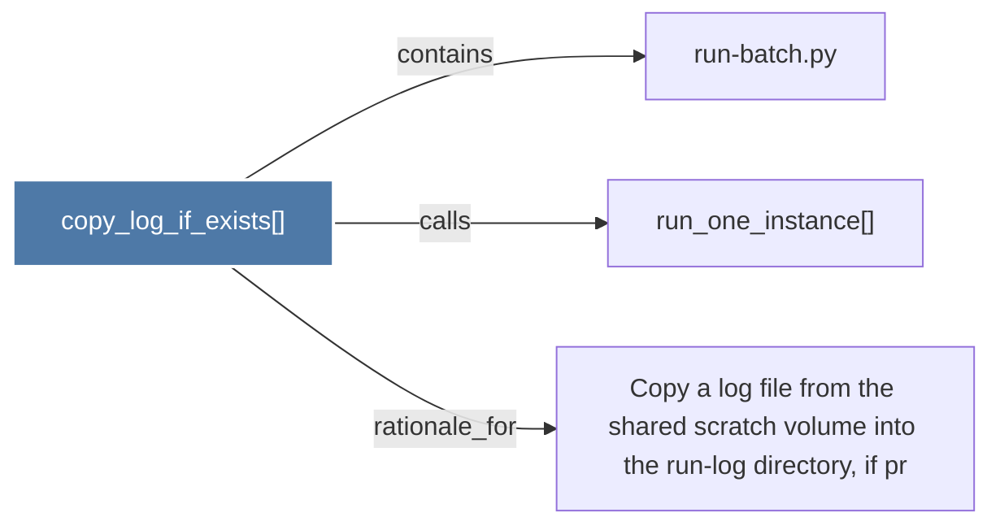

# copy_log_if_exists()

> [!info] Properties
> **File Type**: code
> **Community**: [[_COMMUNITY_Community None|Community None]]
> **Degree**: 3

## Architecture Graph


## Outbound Connections
- [[Copy a log file from the shared scratch volume into the run-log directory, if pr]] - `rationale_for` [EXTRACTED]
- [[run-batch.py]] - `contains` [EXTRACTED]
- [[run_one_instance()]] - `calls` [EXTRACTED]

## Inbound Dependencies
> [!abstract]- Files that link here
```dataview
LIST
FROM [[copy_log_if_exists()]]
```

#graphify/code #graphify/EXTRACTED #community/Community_None